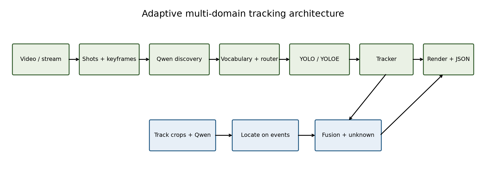
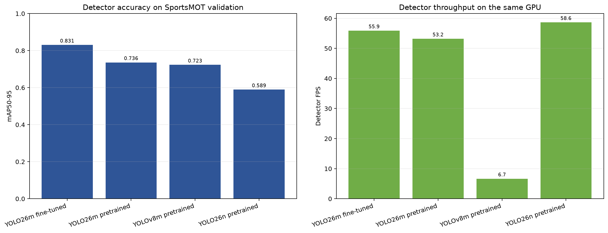
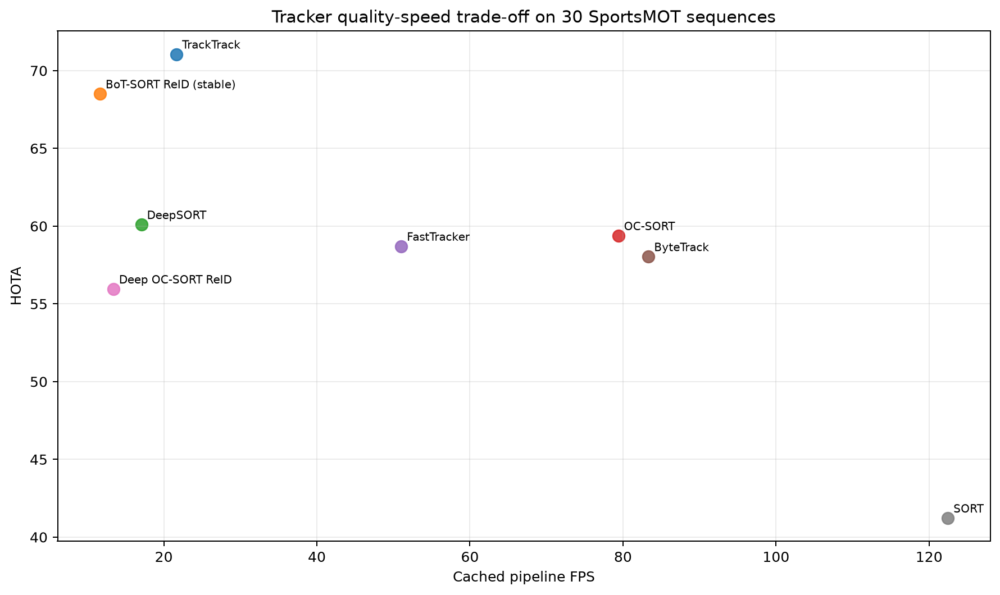
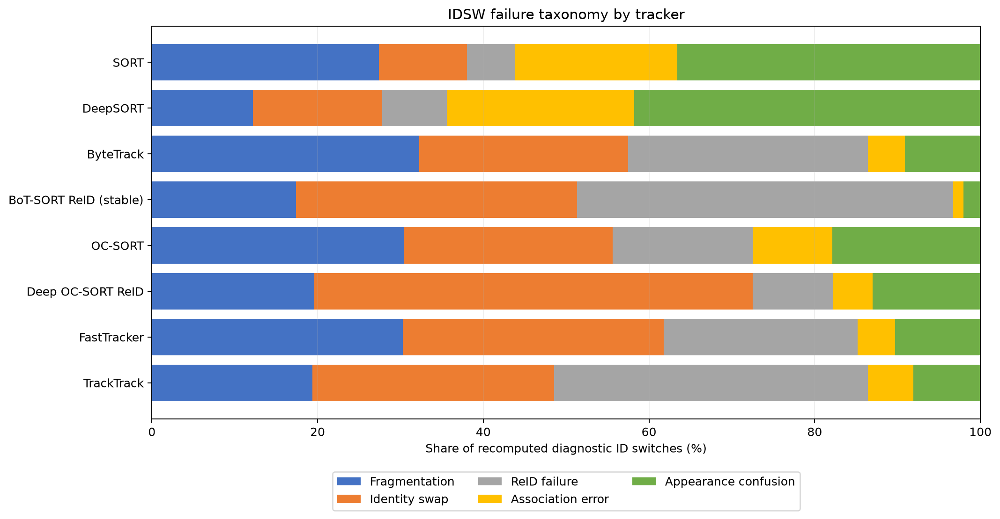
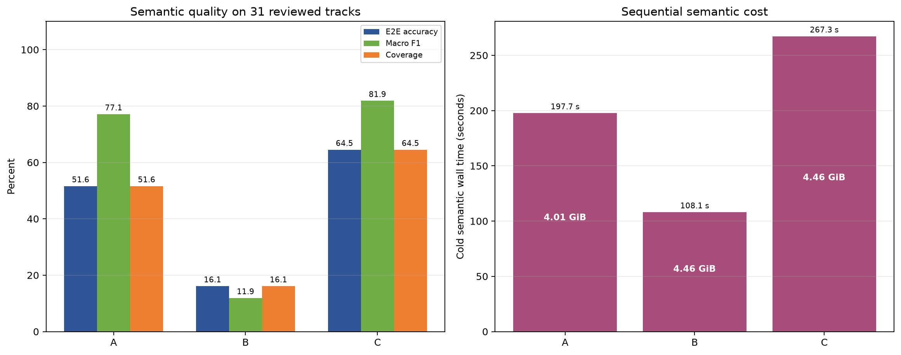
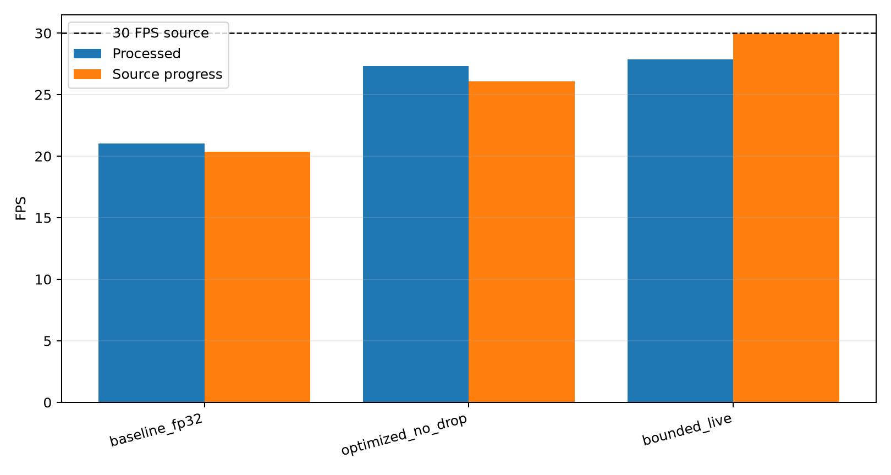
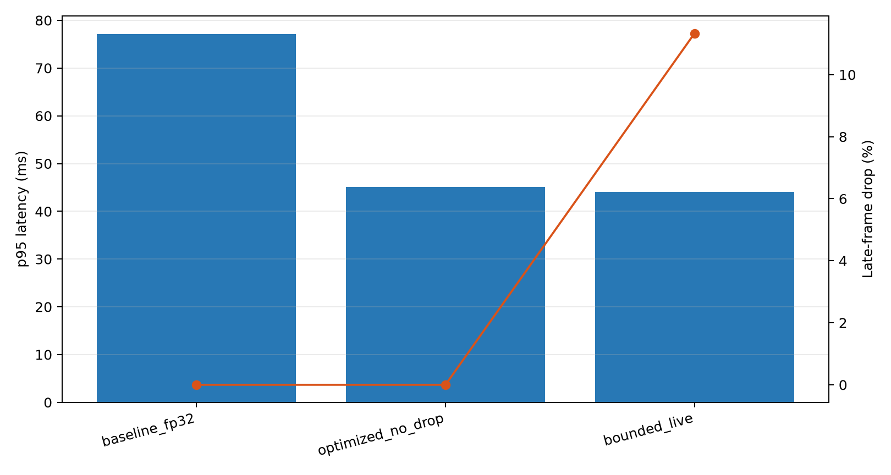
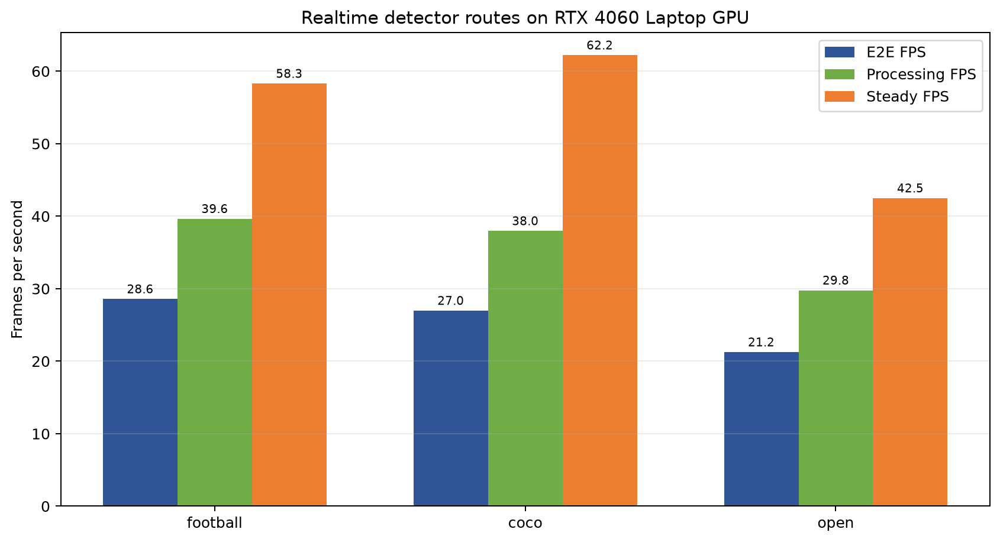
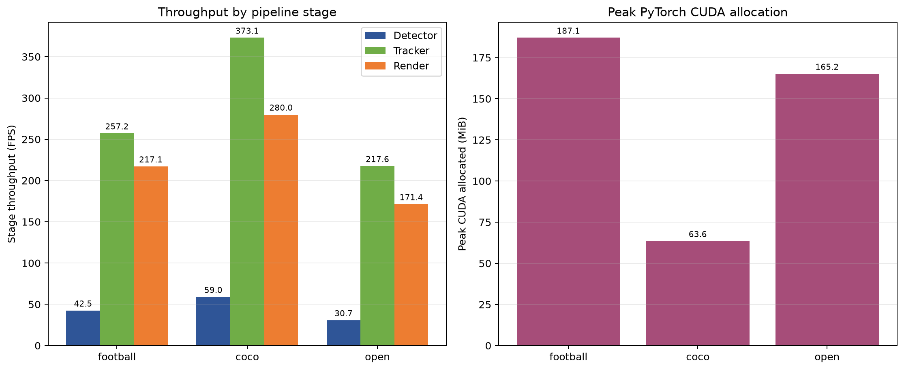

# Adaptive Multi-Domain Visual Tracking

This repository turns a video or live stream into class-aware tracks and deeper semantic
labels without fixing the vocabulary to football.

The production path is:

```text
video / webcam
  -> shot-aware keyframes
  -> Qwen3-VL-4B scene and class discovery
  -> normalized vocabulary and detector routing
  -> YOLO26 / YOLOE detection
  -> class-routed multi-object trackers with one global ID namespace
  -> track crops and event-triggered semantic analysis
  -> unknown rejection, MP4, MOT TXT, JSON, and metrics
```



## Why Tracking Comes Before Deep Semantics

The detector and tracker process every frame. Qwen and LocateAnything process a compact set of
keyframes, uncertain tracks, and multi-time crops. A semantic result is then attached to the
stable `track_id` instead of running a 3B/4B model on every frame. This keeps the live path
responsive and makes every semantic claim auditable.

## Dynamic Vocabulary

1. Shot boundaries are estimated from sampled frame differences.
2. Representative full-frame keyframes are sent to `Qwen/Qwen3-VL-4B-Instruct`.
3. Qwen returns the domain, visible objects, and an action for each object: `track`, `detect`,
   or `context`.
4. The ontology registry merges synonyms, removes attribute-only class names, limits class
   count, and maps known classes to COCO IDs.
5. The detector router selects a checkpoint per class group.

The discovery contract is hierarchical rather than a fixed class list. It stores a stable
base class plus a taxonomy facet and candidate subtypes. Track-level Qwen inference can then
produce labels such as `bird > common kingfisher`. A fine label is accepted only when it is
supported across independent track crops and its fused confidence is at least `0.95`; otherwise
the base class remains valid and the subtype is `unknown`.

| Route | Detector | Use |
|---|---|---|
| Football | fine-tuned YOLO26m | people on football footage |
| COCO | YOLO26n/s pretrained | known general objects |
| Open vocabulary | YOLOE-26s | classes outside the COCO vocabulary |

Football uses a hybrid route: the fine-tuned model tracks people, while a small COCO detector
samples detect-only classes such as the ball. The realtime profile runs this supplemental
detector every six frames and never reuses stale box coordinates.

## Tracker Profiles

| Profile | Tracker | Intended use |
|---|---|---|
| `realtime` | routed OC-SORT | live streams; separate motion tuning for small fast objects |
| `balanced` | routed TrackTrack + OC-SORT | stronger association with a dedicated small-object route |
| `accuracy` | routed BoT-SORT ReID + OC-SORT | appearance-aware identities with a small-object route |

OC-SORT is the realtime default because the local 30-sequence benchmark places it ahead of
the other low-latency candidates on the measured quality-speed trade-off. Appearance-CNN
trackers remain available, but Deep OC-SORT ReID and BoT-SORT ReID were slower on this 8 GB
laptop GPU.

## Semantic Roles

- **Qwen** discovers classes, reads global context, and assigns open semantic labels from
  full-frame keyframes plus multi-time track crops.
- **LocateAnything** is called on uncertain or query-relevant cases to ground a description
  spatially; it is not run continuously on every frame.
- **Fusion** combines accepted evidence and emits `unknown` when confidence or score margin is
  insufficient.

Models run sequentially and are quantized by default (`Qwen` 4-bit, `LocateAnything` 8-bit),
so their VRAM footprints do not add together.

## Installation

Windows PowerShell, Python 3.12:

```powershell
cd F:\Tracking
.\scripts\setup_env.ps1
.\.venv\Scripts\python.exe -m pip install -r requirements\vlm.txt
.\.venv\Scripts\python.exe -m pip install -r requirements\open_vocab.txt
```

Install a CUDA-enabled PyTorch build appropriate for the machine before running the large
models. Check the environment with:

```powershell
.\.venv\Scripts\python.exe -m football_tracking.cli doctor
nvidia-smi
```

## Run One Video

Full adaptive path on `F:\videos\1.mp4`:

```powershell
.\scripts\run_adaptive_tracking.ps1 `
  -SourceVideo F:\videos\1.mp4 `
  -OutputVideo F:\videos\1_adaptive_tracking.mp4 `
  -SemanticOutputVideo F:\videos\1_adaptive_semantic.mp4 `
  -Profile realtime `
  -QwenQuantization 4bit `
  -Device cuda `
  -Overwrite
```

Change only `-SourceVideo` and output names for `2.mp4`, `3.webm`, traffic footage, classroom
footage, or another domain. Do not reuse a discovery cache across different source videos.
On the RTX 4060 Laptop GPU, the measured cold Qwen discovery for two traffic keyframes took
about 171 seconds including model loading. The result is cached by video hash, model, prompt,
sampling, precision, and token budget; a matching repeat does not load Qwen again.

For a short plumbing check:

```powershell
.\scripts\run_adaptive_tracking.ps1 `
  -SourceVideo F:\videos\1.mp4 `
  -OutputVideo F:\videos\1_adaptive_smoke.mp4 `
  -SemanticOutputVideo F:\videos\1_adaptive_smoke_semantic.mp4 `
  -Profile realtime `
  -MaxFrames 120 `
  -SemanticMaxTracks 4 `
  -SemanticMaxImages 4 `
  -Overwrite
```

## Run A Webcam

The camera is calibrated for a few seconds and Qwen creates one vocabulary cache. During the
stream, detector and tracker never wait for the VLM: representative track crops enter an atomic
queue, while a worker updates temporal memory and a semantic cache. The default `deferred` mode
drains that queue automatically after capture so an 8 GB GPU never holds the detector and Qwen
at the same time. Use `-SemanticWorkerMode live` on a server or a separate semantic GPU when
labels must appear during the stream.

```powershell
.\scripts\run_realtime_adaptive.ps1 `
  -Source 0 `
  -RunName webcam_01 `
  -CalibrationSeconds 8 `
  -DiscoveryKeyframes 2 `
  -QwenQuantization 4bit `
  -SemanticWorkerMode deferred `
  -Device cuda `
  -Overwrite
```

Use an RTSP URL instead of `0` for a network camera.

## Outputs

Video products are written to the paths supplied on the command line. Reproducibility artifacts
are stored under `outputs/adaptive_runs/<video_stem>/`:

```text
discovery/scene_discovery.json       domain, objects, actions, evidence
plan/adaptive_plan.json              detector route and tracker profile
plan/tracking.generated.yaml         exact generated runtime config
plan/tracker_routing.generated.yaml  per-class tracker routes and configs
qwen_track_semantics/                keyframes, crops, prompt, model answer
locate_verification/                 event plan and grounding result
fused_track_semantics.json           accepted labels and unknown decisions
semantic_memory.json                 bounded multi-time evidence for every track
adaptive_run_report.json             timings, VRAM, coverage, and provenance
```

The MOT text rows use:

```text
frame, track_id, x, y, width, height, confidence, class_id, visibility, reserved
```

Detection-only classes are rendered as `DET | class` and never receive a fake track ID.

## Verified Results

All detector and tracker quality scores below use SportsMOT ground truth. Runtime measurements
use the same RTX 4060 Laptop GPU (8 GB), rendering enabled, and a 120-frame file source.

### Detector

| Detector | Precision | Recall | mAP50 | mAP50-95 | Detector FPS |
|---|---:|---:|---:|---:|---:|
| YOLO26m fine-tuned | 0.9595 | 0.9601 | 0.9793 | 0.8306 | 55.89 |
| YOLO26m pretrained | 0.8662 | 0.9026 | 0.8935 | 0.7361 | 53.20 |
| YOLOv8m pretrained | 0.8555 | 0.9139 | 0.8932 | 0.7229 | 6.65 |
| YOLO26n pretrained | 0.7865 | 0.8377 | 0.8401 | 0.5894 | 58.65 |



### Tracking

| Tracker | HOTA | IDF1 | Official IDSW | Cached pipeline FPS |
|---|---:|---:|---:|---:|
| TrackTrack | 71.058 | 71.341 | 1042 | 21.66 |
| BoT-SORT ReID stable | 68.503 | 71.352 | 895 | 11.66 |
| OC-SORT | 59.379 | 66.108 | 2186 | 79.40 |
| FastTracker | 58.702 | 64.325 | 2220 | 51.03 |
| ByteTrack | 58.032 | 64.106 | 1828 | 83.33 |



The complete eight-tracker table and the diagnostic five-class IDSW decomposition are in the
[final experiment report](docs/benchmarks/final_experiment_report.md).



### Semantic A/B/C Ablation

The current semantic GT contains 31 manually reviewed tracks from one football video.

| Pipeline | End-to-end accuracy | Macro F1 | Coverage | Cold time | Peak VRAM |
|---|---:|---:|---:|---:|---:|
| A: Qwen | 51.61% | 77.12% | 51.61% | 197.74 s | 4.01 GiB |
| B: LocateAnything | 16.13% | 11.90% | 16.13% | 108.10 s | 4.46 GiB |
| C: Qwen + event Locate | 64.52% | 81.87% | 64.52% | 267.30 s | 4.46 GiB |



### Realtime Routes

| Route | Detector stack | E2E FPS | Steady FPS | P95 | Startup | Peak CUDA |
|---|---|---:|---:|---:|---:|---:|
| Football hybrid | YOLO26m + sampled YOLO26n | 24.75 | 40.40 | 35.06 ms | 0.62 s | 187.1 MiB |
| COCO pretrained | YOLO26n | 34.30 | 46.63 | 25.09 ms | 0.47 s | 63.6 MiB |
| Open vocabulary | YOLO26n + sampled YOLOE-26s | 19.46 | 29.60 | 47.39 ms | 11.75 s | 165.2 MiB |

### 35-Second Realtime Stress Test

The traffic clip was also replayed end to end at 30 FPS on the RTX 4060 Laptop GPU. The
optimized no-drop mode preserves every frame for offline evaluation. The bounded live mode
drops a late frame when necessary, so camera lag stays bounded instead of growing over time.

| Mode | Process FPS | Source progress FPS | P95 latency | Late-frame drop | Peak RAM |
|---|---:|---:|---:|---:|---:|
| FP32 baseline | 21.04 | 20.37 | 77.1 ms | 0.0% | 1.67 GiB |
| Optimized, no drop | 27.35 | 26.10 | 45.1 ms | 0.0% | 2.01 GiB |
| Bounded live | 27.88 | 29.98 | 44.0 ms | 11.3% | 2.03 GiB |





### Public Multi-Domain Trial

Three licensed Wikimedia Commons videos, each at least 30 seconds long, exercise wildlife,
urban traffic, and education.
Qwen generated the domain and vocabulary before detection; the router then selected COCO,
YOLOE, or a composite detector. All runs used sequential 4-bit Qwen and 8-bit LocateAnything
processes on the RTX 4060 Laptop GPU (8 GB).

| Sample | Length | Domain match | Class recall | Tracks | Steady FPS | Short-track proxy |
|---|---:|---:|---:|---:|---:|---:|
| Black noddy flock | 37.9 s | yes | 100% | 36 | 27.21 | 52.8% |
| Street traffic | 35.0 s | yes | 80% | 153 | 32.12 | 64.1% |
| Classroom | 84.3 s | yes | 100% | 206 | 30.28 | 64.6% |

These are video-level discovery checks, not per-track semantic accuracy. The report deliberately
leaves semantic accuracy null until every evaluated track has a human base/fine annotation.
Fine-grained hypotheses below the conservative 0.95 threshold remain `unknown`; this prevents
unsupported species and vehicle subtypes from being rendered as facts. See the
[canonical experiment report](docs/benchmarks/final_experiment_report.md) for the retained
timings, VRAM, coverage, licenses, and charts. Regenerating a raw run writes the detailed report
under `outputs/adaptive_runs/multidomain_long/summary/`.

On the same traffic video and detector outputs, `realtime_stable` (TrackTrack) reduced predicted
IDs from 153 to 87 and tracks shorter than one second from 64.1% to 31.0%. Throughput fell from
32.12 to 22.84 FPS. These are GT-free continuity proxies, not official IDSW; the SportsMOT table
above remains the identity benchmark.





Track continuity on that same 120-frame football clip:

| Route | Frames with tracks | Median track length | Tracks shorter than 30 frames |
|---|---:|---:|---:|
| Football hybrid | 119/120 | 61 | 32.4% |
| COCO pretrained | 119/120 | 21 | 54.0% |
| Open vocabulary | 119/120 | 21 | 54.0% |

`E2E FPS` includes frame decode, detection, tracking, drawing, MOT output, and MP4 writing;
model loading is reported separately as `Startup`. `Steady FPS` excludes the first five warm-up
frames. `Peak CUDA` is peak PyTorch-allocated memory. These are 120-frame file-source runs, not
long-duration webcam claims. The COCO and open-vocabulary rows are routing/runtime stress tests on
football footage; they are not cross-domain accuracy claims.

## Reproduce And Verify

```powershell
.\scripts\run_tracking_benchmark.ps1 -Smoke -Overwrite
.\.venv\Scripts\python.exe scripts\benchmarks\build_final_benchmark_report.py `
  --config configs\benchmarks\final_report.yaml `
  --overwrite
.\.venv\Scripts\python.exe -m ruff check src scripts tests
.\.venv\Scripts\python.exe -m pytest -q
```

The verified local state is `421 passed`. Canonical reports:

- [Final report](docs/benchmarks/final_experiment_report.md)
- [Artifact audit](docs/benchmarks/artifact_audit.json)
- [Runtime CSV](docs/benchmarks/realtime_route_summary.csv)
- [Long realtime benchmark](docs/benchmarks/realtime_long_benchmark.md)
- [Five-pass engineering audit](docs/benchmarks/five_pass_audit.md)
- [Current three-pass completion audit](docs/benchmarks/three_pass_completion_audit.md)
- [All terminal commands](commands.txt)

## Measurement Limits

- Cross-domain routing is implemented and runtime-tested. Review packages now cover 395 tracks
  and 18,814 observations across wildlife, traffic, and education, but their labels still need
  human confirmation before a valid accuracy claim can be made.
- Semantic accuracy currently covers 31 tracks from one football video.
- The five IDSW categories are deterministic diagnostic heuristics. Official tracker ranking
  uses TrackEval IDSW, HOTA, AssA, and IDF1.
- Functional position labels such as striker or midfielder generally require temporal and field
  context; a visible jersey crop alone is not sufficient ground truth.

## Repository Layout

```text
configs/                    adaptive config, profiles, ontology, benchmark contracts
data/                       local datasets and reviewed manifests
docs/                       current design notes, results, and archived documentation
legacy/                     archived demos and compatibility assets
models/                     local promoted checkpoints
outputs/                    generated runs, caches, metrics, and reports
requirements/               base, development, VLM, and open-vocabulary dependencies
scripts/                    supported entry points plus runtime/benchmark/data helpers
src/football_tracking/      package implementation
tests/                      regression and benchmark-contract tests
```

See [project structure](docs/PROJECT_STRUCTURE.md), [config guide](configs/README.md), and
[script guide](scripts/README.md).

## License

See [LICENSE](LICENSE). Model checkpoints and datasets retain their original licenses.
