# Adaptive Multi-Domain Visual Tracking

This repository turns a video or live stream into class-aware tracks and deeper semantic
labels without fixing the vocabulary to football.

The production path is:

```text
video / webcam
  -> shot-aware keyframes
  -> Qwen3-VL-4B scene and class discovery
  -> normalized vocabulary and detector routing
  -> YOLO26 / YOLOE detection
  -> class-routed multi-object trackers with one global ID namespace
  -> track crops and event-triggered semantic analysis
  -> unknown rejection, MP4, MOT TXT, JSON, and metrics
```

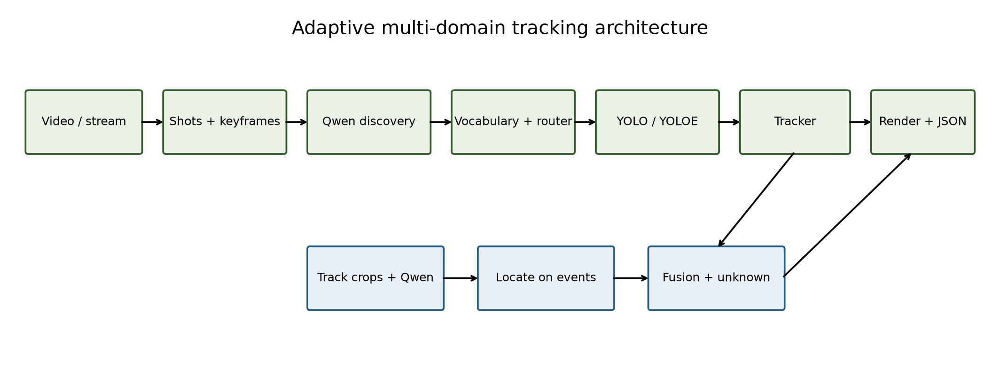

## Why Tracking Comes Before Deep Semantics

The detector and tracker process every frame. Qwen and LocateAnything process a compact set of
keyframes, uncertain tracks, and multi-time crops. A semantic result is then attached to the
stable `track_id` instead of running a 3B/4B model on every frame. This keeps the live path
responsive and makes every semantic claim auditable.

## Dynamic Vocabulary

1. Shot boundaries are estimated from sampled frame differences.
2. Representative full-frame keyframes are sent to `Qwen/Qwen3-VL-4B-Instruct`.
3. Qwen returns the domain, visible objects, and an action for each object: `track`, `detect`,
   or `context`.
4. The ontology registry merges synonyms, removes attribute-only class names, limits class
   count, and maps known classes to COCO IDs.
5. The detector router selects a checkpoint per class group.

The discovery contract is hierarchical rather than a fixed class list. It stores a stable
base class plus a taxonomy facet and candidate subtypes. Track-level Qwen inference can then
produce labels such as `bird > common kingfisher`. A fine label is accepted only when it is
supported across at least two independent, model-visible track frames. Thresholds are stricter
for riskier claims: role `0.82`, subtype `0.85`, species/breed `0.97`, and medical diagnosis
`0.99`. Otherwise the base class remains valid and the fine label is `unknown`.

| Route | Detector | Use |
|---|---|---|
| Football | fine-tuned YOLO26m | people on football footage |
| COCO | YOLO26n/s pretrained | known general objects |
| Open vocabulary | YOLOE-26s | classes outside the COCO vocabulary |

Football uses a hybrid route: the fine-tuned model tracks people, while a small COCO detector
samples detect-only classes such as the ball. The realtime profile runs this supplemental
detector every six frames and never reuses stale box coordinates.

## Tracker Profiles

| Profile | Tracker | Intended use |
|---|---|---|
| `realtime` | routed OC-SORT | live streams; separate motion tuning for small fast objects |
| `realtime_stable` | routed TrackTrack + OC-SORT | stable IDs for recorded video or live feeds that can sustain about 20 FPS |
| `balanced` | routed TrackTrack + OC-SORT | stronger association with a dedicated small-object route |
| `accuracy` | routed BoT-SORT ReID + OC-SORT | appearance-aware identities with a small-object route |

Recorded video defaults to `realtime_stable`: TrackTrack had the strongest HOTA in the local
30-sequence benchmark and substantially fewer short tracks than OC-SORT on the 35-second
traffic trial. Strict live mode remains available as `realtime`; OC-SORT is used there because
it has much lower association latency. Appearance-CNN trackers remain available, but Deep
OC-SORT ReID and BoT-SORT ReID were slower on this 8 GB laptop GPU.

## Semantic Roles

- **LocateAnything** verifies the visible region of each selected track before offline Qwen
  labeling. Its association must clear both a `0.10` composite overlap score and a `0.05`
  margin over the nearest competing track. It can localize a visible fragment of a partly
  occluded object, but cannot recover an object that is fully invisible. In realtime mode it
  is event-triggered, not run continuously on every frame. The one-GPU realtime default
  processes queued events in two deferred phases: Locate first, release VRAM, then Qwen.
- **Qwen** discovers classes, then assigns open semantic labels from one target-local full
  frame plus one multi-time crop panel for each verified track. Returned evidence-frame IDs
  are intersected with the exact frames supplied to that batch before fusion.
- **Fusion** combines accepted evidence and emits `unknown` when confidence or score margin is
  insufficient.

Models run sequentially and are quantized by default (`Qwen` 8-bit, `LocateAnything` 8-bit),
so their VRAM footprints do not add together.

## Installation

### Clone and run a webcam

On Windows with 64-bit Python 3.12, Git, and a supported NVIDIA driver:

```powershell
git clone https://github.com/hieulenho/Football-Player-Detection-and-Multi-Object-Tracking-using-YOLOv8m-and-DeepSORT.git Tracking
cd Tracking
.\scripts\setup_webcam.ps1
.\scripts\run_webcam.ps1 -Overwrite
```

`run_webcam.ps1` searches camera indices `0..5`, selects the first device that returns a
frame, and opens the realtime preview. Use `-CameraIndex 1` to select an external USB camera
explicitly, `-DetectionOnly` to disable downstream semantic processing, or
`-SemanticWorkerMode deferred` for the one-GPU LocateAnything-then-Qwen path. Press `Q` to
stop. Outputs are written under `outputs/adaptive_realtime/webcam_session/`.

YOLO, YOLOE, Qwen, and LocateAnything weights are not stored in Git. Their libraries download
the public checkpoints on first use, so the first run needs internet access, sufficient disk
space, and can take several minutes. Set `HF_TOKEN` before running when authenticated
Hugging Face downloads are desired. An 8 GB NVIDIA GPU should keep the default 8-bit and
deferred semantic settings.

To verify an existing installation without reinstalling packages:

```powershell
.\scripts\setup_webcam.ps1 -VerifyOnly
```

Windows PowerShell, Python 3.12:

```powershell
cd F:\Tracking
.\scripts\setup_env.ps1
.\.venv\Scripts\python.exe -m pip install -r requirements\vlm.txt
.\.venv\Scripts\python.exe -m pip install -r requirements\open_vocab.txt
```

Install a CUDA-enabled PyTorch build appropriate for the machine before running the large
models. Check the environment with:

```powershell
.\.venv\Scripts\python.exe -m football_tracking.cli doctor
nvidia-smi
```

## Run One Video

Full adaptive path on `F:\videos\1.mp4`:

```powershell
.\scripts\run_adaptive_tracking.ps1 `
  -SourceVideo F:\videos\1.mp4 `
  -OutputVideo F:\videos\1_adaptive_tracking.mp4 `
  -SemanticOutputVideo F:\videos\1_adaptive_semantic.mp4 `
  -Profile realtime_stable `
  -QwenQuantization 8bit `
  -Device cuda `
  -SemanticMaxTracks 0 `
  -SemanticMaxImages 2 `
  -SemanticMaxTracksPerBatch 1 `
  -SemanticMaxNewTokens 192 `
  -Overwrite
```

Change only `-SourceVideo` and output names for `2.mp4`, `3.webm`, traffic footage, classroom
footage, or another domain. Do not reuse a discovery cache across different source videos.
The offline semantic path verifies every tracked ID with LocateAnything first, then sends one
target-local full frame plus one multi-time crop panel per ID to Qwen.
`-SemanticMaxTracks 0` means all tracks; batches remain
bounded to one track and two images on an 8 GB GPU, so this affects runtime rather than
coverage. The script now verifies that Locate preparation, Qwen output, and semantic fusion
contain every MOT ID before rendering. A partial semantic run stops with an error instead of
silently showing detector labels such as `person`. Tracks examined by Qwen but rejected by the
unknown policy render as `unknown`; detector fallback is reserved for tracks that were never
modeled.
On the RTX 4060 Laptop GPU, the measured cold Qwen discovery for two traffic keyframes took
about 171 seconds including model loading. The result is cached by video hash, model, prompt,
sampling, precision, and token budget; a matching repeat does not load Qwen again.

For a short plumbing check:

```powershell
.\scripts\run_adaptive_tracking.ps1 `
  -SourceVideo F:\videos\1.mp4 `
  -OutputVideo F:\videos\1_adaptive_smoke.mp4 `
  -SemanticOutputVideo F:\videos\1_adaptive_smoke_semantic.mp4 `
  -Profile realtime `
  -MaxFrames 120 `
  -SemanticMaxTracks 4 `
  -SemanticMaxImages 4 `
  -Overwrite
```

## Run A Webcam

The camera is calibrated for a few seconds and Qwen creates one vocabulary cache. During the
stream, detector and tracker never wait for the VLM: representative track crops enter an atomic
queue, while a worker updates temporal memory and a semantic cache. The default `deferred` mode
drains that queue automatically after capture, running LocateAnything 8-bit first and Qwen
8-bit second so an 8 GB GPU never holds both models at once. `live` keeps tracking non-blocking
and runs Qwen only; use a separate Locate service/GPU when Locate-first labels must appear
during the stream.

```powershell
.\scripts\run_realtime_adaptive.ps1 `
  -Source 0 `
  -RunName webcam_01 `
  -CalibrationSeconds 8 `
  -DiscoveryKeyframes 2 `
  -QwenQuantization 8bit `
  -SemanticWorkerMode deferred `
  -Device cuda `
  -Overwrite
```

Use an RTSP URL instead of `0` for a network camera.

## Outputs

Video products are written to the paths supplied on the command line. Reproducibility artifacts
are stored under `outputs/adaptive_runs/<video_stem>/`:

```text
discovery/scene_discovery.json       domain, objects, actions, evidence
plan/adaptive_plan.json              detector route and tracker profile
plan/tracking.generated.yaml         exact generated runtime config
plan/tracker_routing.generated.yaml  per-class tracker routes and configs
qwen_track_semantics/                keyframes, crops, prompt, model answer
locate_verification/                 event plan and grounding result
fused_track_semantics.json           accepted labels and unknown decisions
semantic_memory.json                 bounded multi-time evidence for every track
adaptive_run_report.json             timings, VRAM, coverage, and provenance
```

Every rendered box now has an explicit evidence source. An accepted Qwen/Locate fusion is a
**deep semantic label**. Tracks outside the bounded VLM budget keep the detector's temporally
voted base class as a **detector fallback**. These are reported separately; final label coverage
must not be presented as VLM accuracy.

The MOT text rows use:

```text
frame, track_id, x, y, width, height, confidence, class_id, visibility, reserved
```

Detection-only classes are rendered as `DET | class` and never receive a fake track ID.

## Verified Results

All detector and tracker quality scores below use SportsMOT ground truth. Runtime measurements
use the same RTX 4060 Laptop GPU (8 GB), rendering enabled, and a 120-frame file source.

### Detector

| Detector | Precision | Recall | mAP50 | mAP50-95 | Detector FPS |
|---|---:|---:|---:|---:|---:|
| YOLO26m fine-tuned | 0.9595 | 0.9601 | 0.9793 | 0.8306 | 55.89 |
| YOLO26m pretrained | 0.8662 | 0.9026 | 0.8935 | 0.7361 | 53.20 |
| YOLOv8m pretrained | 0.8555 | 0.9139 | 0.8932 | 0.7229 | 6.65 |
| YOLO26n pretrained | 0.7865 | 0.8377 | 0.8401 | 0.5894 | 58.65 |

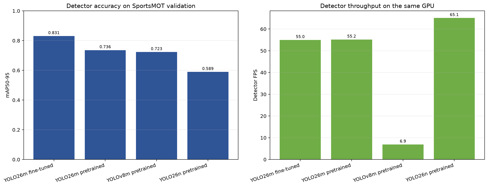

### Tracking

| Tracker | HOTA | IDF1 | Official IDSW | Cached pipeline FPS |
|---|---:|---:|---:|---:|
| TrackTrack | 71.058 | 71.341 | 1042 | 21.66 |
| BoT-SORT ReID stable | 68.503 | 71.352 | 895 | 11.66 |
| OC-SORT | 59.379 | 66.108 | 2186 | 79.40 |
| FastTracker | 58.702 | 64.325 | 2220 | 51.03 |
| ByteTrack | 58.032 | 64.106 | 1828 | 83.33 |

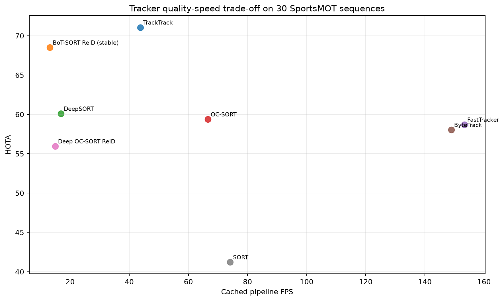

The complete eight-tracker table and the diagnostic five-class IDSW decomposition are in the
[final experiment report](docs/benchmarks/final_experiment_report.md).

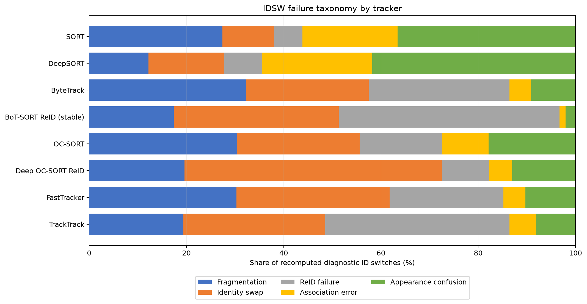

### Semantic A/B/C Ablation

All three pipelines use the same 20 predicted tracks, matched to official UA-DETRAC vehicle
annotations at IoU 0.5. Track selection uses observation count only and cannot inspect semantic
labels or GT classes.

| Pipeline | Accuracy | Macro F1 | Coverage | Unknown F1 | Hallucination | Cold time | Peak VRAM |
|---|---:|---:|---:|---:|---:|---:|---:|
| A: Qwen | 75.00% | 91.67% | 75.00% | 61.54% | 26.67% | 475.44 s | 4.89 GiB |
| B: LocateAnything | 45.00% | 80.43% | 75.00% | 15.38% | 46.67% | 350.87 s | 4.56 GiB |
| C: Qwen + Locate | 60.00% | 88.46% | 90.00% | 20.00% | 38.89% | 826.31 s | 4.89 GiB |

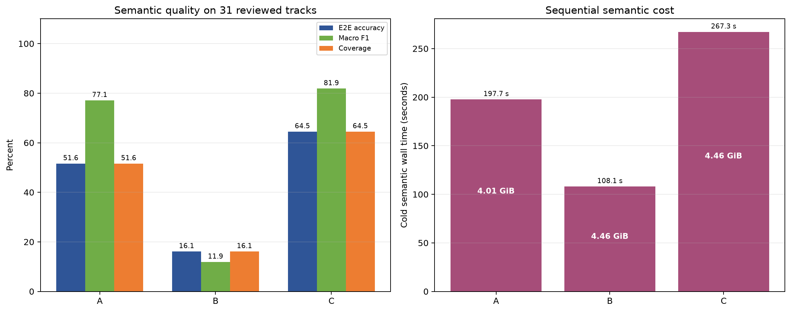

Pipeline A is the most accurate classifier in this traffic sample. Pipeline C raises coverage,
but weak LocateAnything evidence also introduces wrong labels. LocateAnything is therefore kept
as spatial evidence, not treated as an independent fine-grained classifier. Strict fine-label
accuracy is 0% because no subtype passed the conservative 0.95 acceptance threshold; before
rejection, Qwen proposed the matched `van` subtype correctly, giving A and C 100% candidate
fine-label accuracy on the supported candidate set.

### Five-Domain 8-Bit Suite

The current 30-60 second suite covers two traffic scenes, wildlife, classroom, and microscopy.
On the RTX 4060 Laptop GPU it reached 5/5 domain-family matches and 23.15 mean steady detector+
tracker FPS. All 338 tracks have a rendered base label; only accepted semantic tracks count as
direct VLM coverage. Human semantic accuracy remains intentionally null until the generated
338-track review package is completed.

- [Multi-domain trial report](outputs/adaptive_runs/multidomain_suite_8bit/summary/multidomain_trial_report.md)
- [GT-backed tracking comparison](docs/benchmarks/multidomain_tracking_summary.md)
- Annotation packages: `data/semantic_gt/multidomain_suite_8bit/`

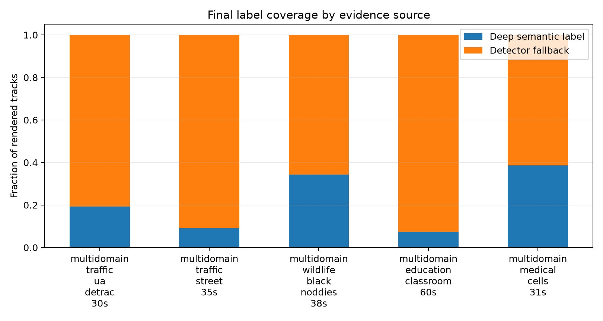

### Realtime Routes

| Route | Detector stack | E2E FPS | Steady FPS | P95 | Startup | Peak CUDA |
|---|---|---:|---:|---:|---:|---:|
| Football hybrid | YOLO26m + sampled YOLO26n | 24.75 | 40.40 | 35.06 ms | 0.62 s | 187.1 MiB |
| COCO pretrained | YOLO26n | 34.30 | 46.63 | 25.09 ms | 0.47 s | 63.6 MiB |
| Open vocabulary | YOLO26n + sampled YOLOE-26s | 19.46 | 29.60 | 47.39 ms | 11.75 s | 165.2 MiB |

### 35-Second Realtime Stress Test

The traffic clip was also replayed end to end at 30 FPS on the RTX 4060 Laptop GPU. The
optimized no-drop mode preserves every frame for offline evaluation. The bounded live mode
drops a late frame when necessary, so camera lag stays bounded instead of growing over time.

| Mode | Process FPS | Source progress FPS | P95 latency | Late-frame drop | Peak RAM |
|---|---:|---:|---:|---:|---:|
| FP32 baseline | 21.04 | 20.37 | 77.1 ms | 0.0% | 1.67 GiB |
| Optimized, no drop | 27.35 | 26.10 | 45.1 ms | 0.0% | 2.01 GiB |
| Bounded live | 27.88 | 29.98 | 44.0 ms | 11.3% | 2.03 GiB |

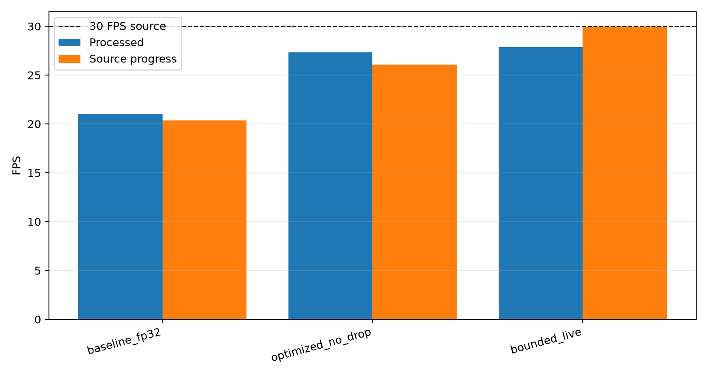

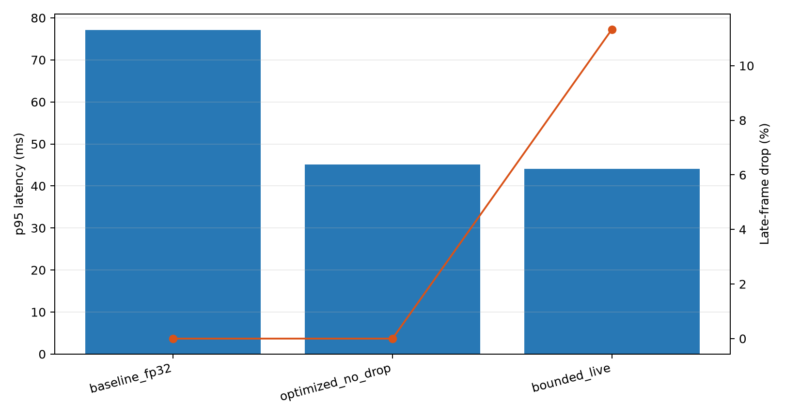

### Public Multi-Domain Trial

Three licensed Wikimedia Commons videos, each at least 30 seconds long, exercise wildlife,
urban traffic, and education.
Qwen generated the domain and vocabulary before detection; the router then selected COCO,
YOLOE, or a composite detector. All runs used sequential 4-bit Qwen and 8-bit LocateAnything
processes on the RTX 4060 Laptop GPU (8 GB).

| Sample | Length | Domain match | Class recall | Tracks | Steady FPS | Short-track proxy |
|---|---:|---:|---:|---:|---:|---:|
| Black noddy flock | 37.9 s | yes | 100% | 36 | 27.21 | 52.8% |
| Street traffic | 35.0 s | yes | 80% | 153 | 32.12 | 64.1% |
| Classroom | 84.3 s | yes | 100% | 206 | 30.28 | 64.6% |

These are video-level discovery checks, not per-track semantic accuracy. The report deliberately
leaves semantic accuracy null until every evaluated track has a human base/fine annotation.
Fine-grained hypotheses below the conservative 0.95 threshold remain `unknown`; this prevents
unsupported species and vehicle subtypes from being rendered as facts. See the
[canonical experiment report](docs/benchmarks/final_experiment_report.md) for the retained
timings, VRAM, coverage, licenses, and charts. Regenerating a raw run writes the detailed report
under `outputs/adaptive_runs/multidomain_long/summary/`.

For GT-backed expansion, the repository now registers SportsMOT, TAO, BDD100K,
AnimalTrack, Cell Tracking Challenge and the local classroom review package. The
[multi-domain completion protocol](docs/benchmarks/multidomain_completion_protocol.md)
documents access conditions, annotation conversion, semantic rejection metrics, IDSW
double review and physical realtime release gates.

On the same traffic video and detector outputs, `realtime_stable` (TrackTrack) reduced predicted
IDs from 153 to 87 and tracks shorter than one second from 64.1% to 31.0%. Throughput fell from
32.12 to 22.84 FPS. These are GT-free continuity proxies, not official IDSW; the SportsMOT table
above remains the identity benchmark.

### GT-Backed Multi-Domain Tracking

| Domain and protocol | Detector + tracker | Frames | HOTA | IDF1 | IDSW | E2E FPS |
|---|---|---:|---:|---:|---:|---:|
| SportsMOT football, 30 sequences | fine-tuned YOLO26m + TrackTrack | 20,171 | 71.058 | 71.341 | 1,042 | 21.66 |
| UA-DETRAC traffic, 30 seconds | YOLO26n + OC-SORT | 750 | 64.906 | 75.045 | 4 | 21.58 |
| AnimalTrack Zebra, 5 sequences | YOLO26s + TrackTrack | 1,378 | 54.097 | 68.038 | 130 | 5.64 |
| CTC microscopy, held-out sequence | YOLO26s adapter + OC-SORT | 92 | 70.559 | 90.054 | 0 | 10.38 |

The zero-shot YOLOE microscopy route produced no detections and 4,575 false negatives. Training
the adapter on CTC sequence 01 and evaluating only on unseen sequence 02 recovered the result
shown above. Cross-domain scores are not directly interchangeable because object scale,
ontology, density, and annotation policy differ. See the
[full multi-domain tracking table](docs/benchmarks/multidomain_tracking_summary.md).

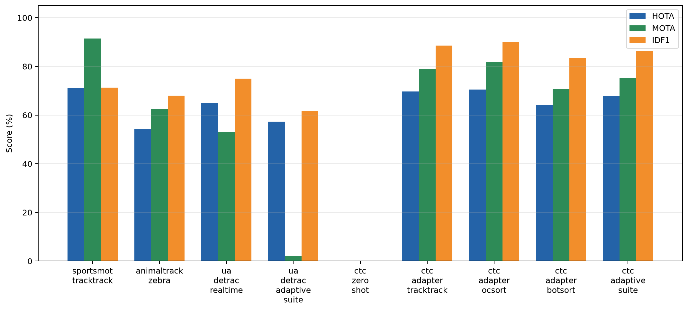

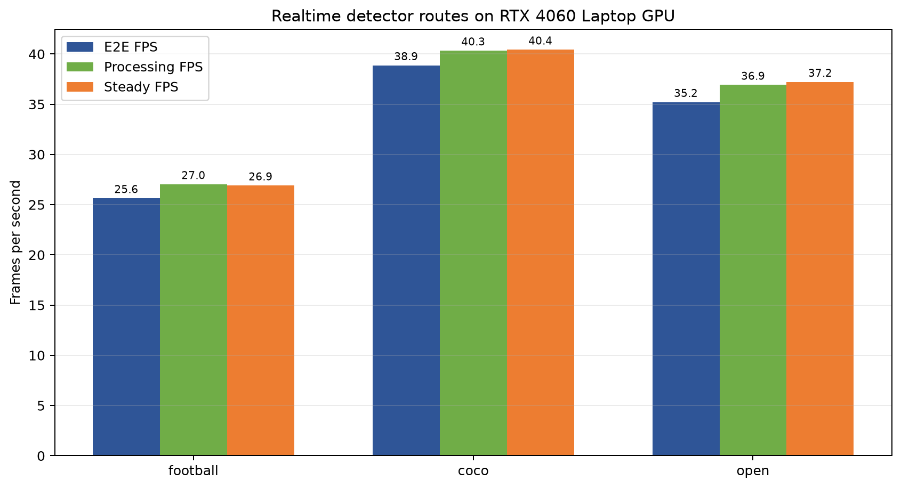

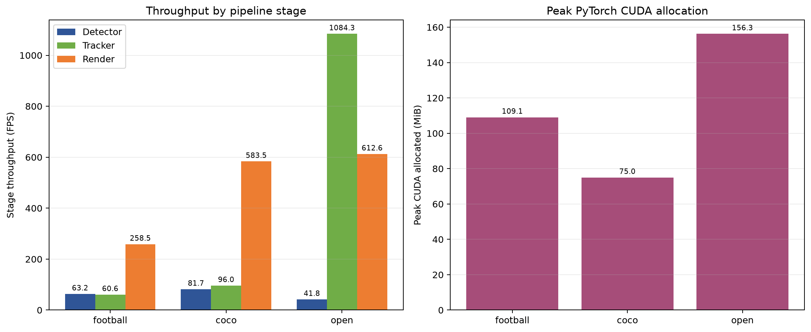

Track continuity on that same 120-frame football clip:

| Route | Frames with tracks | Median track length | Tracks shorter than 30 frames |
|---|---:|---:|---:|
| Football hybrid | 119/120 | 61 | 32.4% |
| COCO pretrained | 119/120 | 21 | 54.0% |
| Open vocabulary | 119/120 | 21 | 54.0% |

`E2E FPS` includes frame decode, detection, tracking, drawing, MOT output, and MP4 writing;
model loading is reported separately as `Startup`. `Steady FPS` excludes the first five warm-up
frames. `Peak CUDA` is peak PyTorch-allocated memory. These are 120-frame file-source runs, not
long-duration webcam claims. The COCO and open-vocabulary rows are routing/runtime stress tests on
football footage; they are not cross-domain accuracy claims.

## Reproduce And Verify

```powershell
.\scripts\run_tracking_benchmark.ps1 -Smoke -Overwrite
.\.venv\Scripts\python.exe scripts\benchmarks\build_final_benchmark_report.py `
  --config configs\benchmarks\final_report.yaml `
  --overwrite
.\.venv\Scripts\python.exe -m ruff check src scripts tests
.\.venv\Scripts\python.exe -m pytest -q
```

The verified local state is `489 passed` (2026-07-27). Canonical reports:

- [Final report](docs/benchmarks/final_experiment_report.md)
- [Artifact audit](docs/benchmarks/artifact_audit.json)
- [Runtime CSV](docs/benchmarks/realtime_route_summary.csv)
- [Long realtime benchmark](docs/benchmarks/realtime_long_benchmark.md)
- [GT-backed multi-domain tracking](docs/benchmarks/multidomain_tracking_summary.md)
- [Five-pass engineering audit](docs/benchmarks/five_pass_audit.md)
- [Current three-pass completion audit](docs/benchmarks/three_pass_completion_audit.md)
- [Multi-domain completion protocol](docs/benchmarks/multidomain_completion_protocol.md)
- [All terminal commands](commands.txt)

The machine-readable release gate is generated at
`outputs/benchmarks/multidomain/completion/completion_gate.md`. Official semantic GT now
covers 40 tracks across UA-DETRAC traffic and AnimalTrack wildlife. The gate remains
`INCOMPLETE` only where independent IDSW double review is still missing.

## Measurement Limits

- Cross-domain routing is implemented and runtime-tested. The current five-domain review
  packages cover 338 tracks and 33,671 MOT observations across traffic, wildlife, education,
  and microscopy, but their labels still need human confirmation before a valid accuracy
  claim can be made.
- Comparable A/B/C semantic accuracy covers 20 UA-DETRAC traffic tracks and 20 AnimalTrack
  Zebra tracks from official annotations. Equivalent matrices are still needed for sports,
  medical, education, and a broader set of fine-grained classes.
- The five IDSW categories are deterministic diagnostic heuristics. Evidence sheets exist for
  all 52 smoke events, but two independent reviews and adjudication are still required. Official
  tracker ranking uses TrackEval IDSW, HOTA, AssA, and IDF1.
- The physical webcam protocol contains three repeated 900-frame runs per profile on the
  RTX 4060 Laptop GPU. File replay remains separate and is not reported as camera latency.
- Functional position labels such as striker or midfielder generally require temporal and field
  context; a visible jersey crop alone is not sufficient ground truth.

## Repository Layout

```text
configs/                    adaptive config, profiles, ontology, benchmark contracts
data/                       local datasets and reviewed manifests
docs/                       current design notes, results, and archived documentation
models/                     local promoted checkpoints
outputs/                    generated runs, caches, metrics, and reports
requirements/               base, development, VLM, and open-vocabulary dependencies
scripts/                    supported entry points, helpers, and legacy compatibility workflows
src/football_tracking/      package implementation
tests/                      regression and benchmark-contract tests
```

See [project structure](docs/PROJECT_STRUCTURE.md), [config guide](configs/README.md), and
[script guide](scripts/README.md).

## License

See [LICENSE](LICENSE). Model checkpoints and datasets retain their original licenses.
