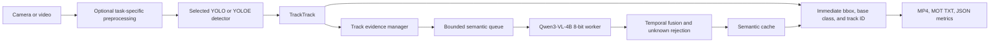

# Realtime Tracking With Qwen Semantics

This repository implements a task-configured video pipeline that detects objects, assigns
stable track IDs, and enriches selected tracks with deeper labels from one asynchronous
`Qwen/Qwen3-VL-4B-Instruct` 8-bit worker.

The main runtime is deliberately explicit. A task file states what the user wants to track,
which detector checkpoint to use, which labels are valid, and which attributes matter. The
system does not guess the deployment objective from a few opening frames.

## Main Pipeline


```mermaid
flowchart LR
    A[Camera or video] --> B[Optional task-specific preprocessing]
    B --> C[Selected YOLO or YOLOE detector]
    C --> D[TrackTrack]
    D --> E[Immediate bbox, base class, and track ID]
    D --> F[Track evidence manager]
    F --> G[Bounded semantic queue]
    G --> H[Qwen3-VL-4B 8-bit worker]
    H --> I[Temporal fusion and unknown rejection]
    I --> J[Semantic cache]
    J --> E
    E --> K[MP4, MOT TXT, JSON metrics]
```

The detector and tracker process every frame. Qwen receives only bounded evidence for a
persistent track: a scene view with the target highlighted and up to two high-quality crops
from different times. A semantic result is attached to the `track_id` and reused on later
frames. This avoids running a 4B model on every frame.

### Design choices

- **Detector is selected per task.** Use a fine-tuned checkpoint for a private dataset, a
  pretrained YOLO checkpoint for known classes, or YOLOE with an explicit text vocabulary.
- **TrackTrack is the default tracker.** It achieved the best saved SportsMOT HOTA. OC-SORT,
  ByteTrack, BoT-SORT ReID, DeepSORT, Deep OC-SORT ReID, and FastTracker remain benchmark
  profiles.
- **Base labels appear immediately.** Deep labels initially show `waiting` or `pending`, then
  change to an accepted Qwen label or `unknown`.
- **Class stabilization is temporal.** Short detector-class flips do not immediately change a
  persistent track's class.
- **Semantic work is bounded.** One pending job is retained per track; a better crop can replace
  a weaker pending crop without creating an unbounded queue.
- **Unknown is a valid result.** A role, species, subtype, make, or model is not rendered as fact
  unless confidence, margin, taxonomy, and temporal checks pass.

LocateAnything is retained only under the legacy/ablation code. It is not part of the main
single-VLM runtime because the measured Qwen-only traffic sample was more accurate and the
second 3B model adds substantial latency and deployment complexity.

## Requirements

- Windows PowerShell
- 64-bit Python 3.12
- Git for cloning the repository and optional TrackEval research dependencies
- NVIDIA GPU recommended; the measured machine used an RTX 4060 Laptop GPU with 8 GB VRAM
- A CUDA-enabled PyTorch build matching the installed NVIDIA driver

### Install after cloning

```powershell
git clone <repository-url> Tracking
cd Tracking
.\scripts\setup_webcam.ps1
```

The production installer uses `requirements/runtime.txt` plus `requirements/qwen.txt`. It does
not install TrackEval, pandas, or plotting libraries. Public checkpoints are downloaded on first
use and are not stored in Git.

Optional YOLOE open-vocabulary support:

```powershell
.\.venv\Scripts\python.exe -m pip install -r requirements\open_vocab.txt
```

Optional legacy LocateAnything ablations:

```powershell
.\.venv\Scripts\python.exe -m pip install -r requirements\locate_tracking.txt
```

Verify an existing environment:

```powershell
.\scripts\setup_webcam.ps1 -VerifyOnly
nvidia-smi
```

## Run The Pipeline

### Webcam

```powershell
.\scripts\run_task_webcam.ps1 `
  -TaskConfig configs\tasks\generic_coco_realtime.yaml `
  -CameraIndex 0 `
  -RunName webcam_generic `
  -SemanticWorkerMode live `
  -LiveSemanticMaxPendingEvents 4 `
  -Overwrite
```

The preview opens automatically. Press `Q` or `Esc` to stop. `live` keeps Qwen loaded in a
separate process and updates labels while capture continues. The detector label is immediate;
the first deep label is delayed by model loading, evidence collection, and generation.
On the measured RTX 4060 Laptop 8 GB system, one compact traffic job required about 19 seconds
after an 18-22 second cold model load. The live queue therefore defaults to four in-flight
tracks; raising it increases label wait time and disk work rather than model throughput.

Use `-SemanticWorkerMode disabled` to measure detector/tracker throughput, or `deferred` when
processing a file on one 8 GB GPU and final labels are allowed to appear after tracking ends.
For dense traffic on a single 8 GB GPU, `disabled` preserves the highest foreground FPS and
`deferred` is the reliable way to obtain deep labels for every retained track. Concurrent
`live` Qwen inference competes with YOLO for the same GPU and cannot deeply label every
short-lived vehicle at camera rate.

### Recorded video

```powershell
.\scripts\run_task_realtime.ps1 `
  -TaskConfig configs\tasks\classroom_roles.yaml `
  -Source F:\videos\multidomain_education_classroom_60s.mp4 `
  -RunName classroom_01 `
  -OutputRoot F:\videos\final `
  -SemanticWorkerMode deferred `
  -Device cuda `
  -NoWindow `
  -Overwrite
```

Deferred mode first writes the complete MOT result, processes queued tracks in one persistent
Qwen session, then renders accepted labels back onto the video.

### Provided task profiles

| Task file | Detector scope | Deep semantic objective |
|---|---|---|
| `generic_coco_realtime.yaml` | all COCO classes | open subtype/category |
| `football_roles.yaml` | football people | team/role taxonomy |
| `classroom_roles.yaml` | people | student/teacher/staff/visitor |
| `traffic_objects.yaml` | traffic classes | vehicle subtype and visible attributes |
| `wildlife_birds.yaml` | birds | conservative species/subtype |
| `microscopy_cells.yaml` | task adapter | morphology without diagnosis |
| `open_vocabulary_example.yaml` | explicit YOLOE text classes | open hierarchical label |

For a private dataset, copy the closest task YAML, point `detector.checkpoint` to the trained
weights, set detector classes, and define the semantic instruction and taxonomy. The runtime
does not need a Detector Router when the deployment task is already known.

## Output Contract

Each run is isolated under `<OutputRoot>/<RunName>/`:

```text
runtime/task.resolved.json          exact task contract
runtime/tracking.generated.yaml     exact detector/tracker runtime
tracked_semantic.mp4                rendered result
tracked_semantic.txt                MOT rows
realtime_metrics.json               latency, FPS, coverage, resources
semantic_queue/                     atomic pending/processed/failed jobs
semantic_memory.json                bounded temporal evidence
semantic_cache.json                 accepted and rejected track labels
semantic_worker_report.json         Qwen timing and failures
```

MOT rows use:

```text
frame, track_id, x, y, width, height, confidence, class_id, visibility, reserved
```

The rendered label source matters:

- `base`: detector class only
- `waiting`: no semantic job yet
- `pending`: evidence is queued or currently being processed
- `accepted`: Qwen label passed fusion and rejection checks
- `unknown`: Qwen evidence was insufficient or conflicting

Coverage is not accuracy. A box having some label does not prove that its deep label is correct.

## Verified Results

Canonical machine-readable tables, plots, hashes, and limitations are in the
[research report](docs/benchmarks/research_final/research_report.md).
The measured queue and concurrent-Qwen behavior for a dense traffic stream is documented in
the [dense traffic live semantic benchmark](docs/benchmarks/dense_traffic_live_semantics.md).

### Detector on SportsMOT validation

| Model | Precision | Recall | mAP50 | mAP50-95 | Detector FPS |
|---|---:|---:|---:|---:|---:|
| YOLO26m fine-tuned | 0.9595 | 0.9601 | 0.9793 | 0.8306 | 54.97 |
| YOLO26m pretrained | 0.8662 | 0.9026 | 0.8935 | 0.7361 | 55.16 |
| YOLOv8m pretrained | 0.8555 | 0.9139 | 0.8932 | 0.7229 | 6.91 |
| YOLO26n pretrained | 0.7865 | 0.8377 | 0.8401 | 0.5894 | 65.08 |

### Tracking on 30 SportsMOT sequences

| Tracker | HOTA | IDF1 | Official IDSW | Cached pipeline FPS |
|---|---:|---:|---:|---:|
| TrackTrack | 71.058 | 71.341 | 1,042 | 43.73 |
| BoT-SORT ReID | 68.503 | 71.352 | 895 | 13.15 |
| OC-SORT | 59.379 | 66.108 | 2,186 | 66.59 |
| ByteTrack | 58.032 | 64.106 | 1,828 | 148.93 |

TrackTrack is the default quality-balanced profile. BoT-SORT ReID has fewer ID switches but is
roughly three times slower in this shared-detection benchmark. OC-SORT and ByteTrack are useful
when throughput is more important than association quality.

### GT-backed multidomain checks

| Task | Frames | HOTA | MOTA | IDF1 | IDSW |
|---|---:|---:|---:|---:|---:|
| UA-DETRAC traffic, class-agnostic | 750 | 66.127 | 50.523 | 74.482 | 3 |
| UA-DETRAC traffic, hard class gate | 750 | 64.993 | 49.733 | 73.463 | 4 |
| AnimalTrack zebra, YOLOE zero-shot | 1,378 | 37.719 | 30.567 | 43.542 | 272 |
| CTC microscopy, no preprocessing | 92 | 67.890 | 75.248 | 86.442 | 0 |
| CTC microscopy, CLAHE | 92 | 69.526 | 80.373 | 88.009 | 0 |

Class-agnostic association followed by temporal class stabilization improved every reported
UA-DETRAC identity metric over the otherwise identical hard-gate run, so it is the production
multiclass policy. The AnimalTrack result is a useful negative result: open vocabulary does not
remove the need for a detector adapted to small or difficult targets. CLAHE improved the
held-out microscopy score but reduced runtime throughput, so preprocessing remains task-specific.

### Qwen semantic check

On 20 UA-DETRAC tracks matched to official GT, Qwen reached 75.0% overall accuracy, 75.0%
coverage, 73.3% selective accuracy, 61.5% unknown-rejection F1, and a 26.7% hallucination rate.
The known-class Macro-F1 was 91.7%. This sample is too small to claim general multidomain
semantic accuracy.


## Reproduce Research Artifacts

```powershell
.\scripts\benchmarks\run_task_runtime_suite.ps1 -Repeats 3 -Overwrite
.\.venv\Scripts\python.exe scripts\benchmarks\build_task_research_report.py `
  --config configs\benchmarks\task_research_report.yaml `
  --overwrite
.\.venv\Scripts\python.exe -m ruff check src scripts tests
.\.venv\Scripts\python.exe -m pytest -q
```

See [commands.txt](commands.txt) for the complete command set and
[the TaskConfig design note](docs/REALTIME_SINGLE_VLM_PIPELINE_PLAN.txt) for stage-by-stage
reasoning.

## Scientific Limits

- Official detector/tracker claims use GT. The five-way IDSW subtype split is a heuristic
  diagnostic; only total TrackEval IDSW is official.
- The saved 338-track multidomain semantic package is still awaiting human review. Until that
  review is complete, per-domain semantic accuracy and Macro-F1 are intentionally not claimed.
- The formal 900-frame webcam foreground benchmark measures capture, detection, tracking,
  rendering, and queue bookkeeping. Qwen generation latency is reported separately.
- A current TaskConfig camera smoke was limited by a camera source delivering about 1 FPS; it
  verifies integration but is not a model-throughput result.
- No system can guarantee a deep label for every fast or occluded object. The safe output is
  the stable base detector class plus `unknown` when evidence is insufficient.

## Repository Layout

```text
configs/tasks/                 deployment intent and taxonomy
configs/trackers/              tracker profiles
configs/benchmarks/            measurement contracts
src/football_tracking/task_pipeline/  TaskConfig validation/building
src/football_tracking/tracking/       detector-to-track runtime
src/football_tracking/adaptive_tracking/ semantic queue/fusion/cache
scripts/run_task_realtime.ps1  primary file/stream entrypoint
scripts/run_task_webcam.ps1    primary webcam entrypoint
scripts/benchmarks/            reproducible evaluation tools
scripts/legacy/                historical A/B/C compatibility only
docs/benchmarks/research_final/ canonical report, CSVs, and figures
tests/                         regression and contract tests
```

## License

See [LICENSE](LICENSE). Datasets and model checkpoints retain their original licenses.
