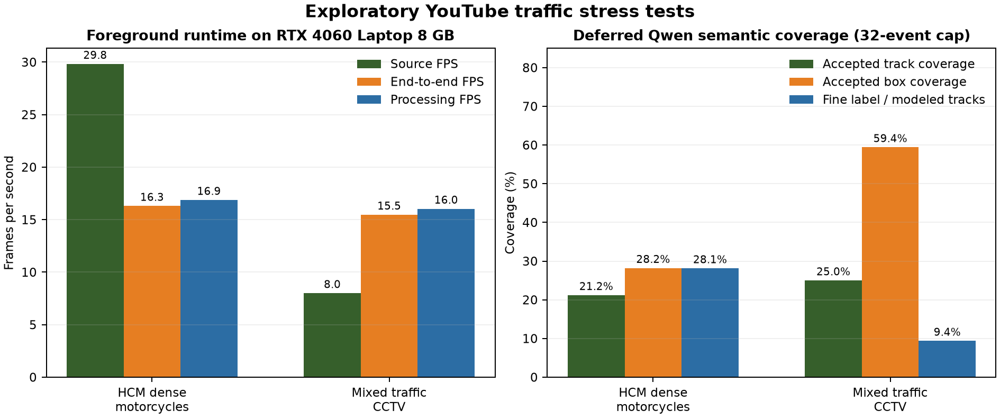

# Dense Traffic Live Semantic Benchmark

## Scope

- Hardware: NVIDIA GeForce RTX 4060 Laptop GPU, 8,188 MiB VRAM
- Driver: 596.08
- Source: UA-DETRAC `MVI_40774`, 25 FPS
- Detector/tracker task: `configs/tasks/traffic_objects.yaml`
- Semantic model: `Qwen/Qwen3-VL-4B-Instruct`, 8-bit
- Evidence: one 448 x 336 panel per semantic job

## Foreground and Queue Cost

The first comparison processes the same 300 frames without running Qwen. It isolates the
cost of queue bookkeeping, crop selection, evidence panels, rendering, and video writing.

| Profile | End-to-end FPS | Processing FPS | P95 latency | Queue ms/frame | Enqueued | Pending |
|---|---:|---:|---:|---:|---:|---:|
| Tracking only | 28.518 | 29.496 | 42.89 ms | 0.001 | 0 | 0 |
| Queue capacity 12 | 24.777 | 25.548 | 50.25 ms | 0.974 | 14 | 12 |
| Queue capacity 4 | 25.395 | 26.272 | 45.22 ms | 0.389 | 4 | 4 |

The capacity-four profile keeps up with the 25 FPS source and is now the live default.
Backpressure is applied before crop creation, and tracks already being processed count toward
the same bound.

## Concurrent Qwen Result

The second run processes all 750 frames with a live Qwen worker and queue capacity four.

| Metric | Result |
|---|---:|
| End-to-end FPS | 19.892 |
| Processing FPS | 20.596 |
| P95 frame latency | 80.56 ms |
| Keeps up with 25 FPS source | No |
| Semantic jobs completed during run | 1 |
| Semantic jobs left pending | 3 |
| Qwen cold load | 25.775 s |
| Qwen inference for one track | 19.856 s |
| Qwen peak reserved VRAM | 5.234 GB |

The worker exited cleanly after the foreground loop, removed its PID file, and released GPU
memory. The completed track was accepted as `car`; Qwen also returned visible color and motion
attributes. A separate fine-label smoke requested an open vehicle subtype but correctly kept
the subtype unknown because the distant evidence did not support a more specific label.

## Interpretation

`waiting` means a track has only its immediate detector label and has not entered the bounded
semantic queue. `pending` means its evidence is queued or currently inside Qwen. Neither state
blocks detection or tracking.

On one 8 GB GPU, a 4B VLM cannot deeply classify every short-lived road user at camera rate.
YOLO and Qwen compete for the same GPU while a semantic job is running. Use:

- `disabled` for the highest live FPS with immediate detector classes;
- `live` for sparse, delayed deep labels on persistent tracks;
- `deferred` for recorded video when all retained tracks should be processed before the final
  semantic render.

Raw artifacts:

- `outputs/benchmarks/dense_traffic_runtime/traffic_foreground_300/`
- `outputs/benchmarks/dense_traffic_runtime/traffic_queue_300/`
- `outputs/benchmarks/dense_traffic_runtime/traffic_queue_cap4_300/`
- `outputs/benchmarks/dense_traffic_runtime/traffic_live_qwen_cap4_750/`
- `outputs/benchmarks/dense_traffic_runtime/traffic_fine_label_smoke/`

## Deferred Deep-Label Verification

The current traffic task adds sparse YOLOE-26s subtype proposals and temporal visible-color
hints before Qwen verification. A clean 300-frame run then drained every eligible semantic job
through one Qwen3-VL-4B 8-bit session.

| Metric | Result |
|---|---:|
| Detector + tracker + fast-label FPS | 15.297 |
| P95 foreground latency | 103.37 ms |
| Tracks produced | 25 |
| Tracks eligible for Qwen | 22 |
| Qwen-accepted tracks | 22/25 (88%) |
| Accepted-box coverage | 99.00% |
| Fine subtype coverage among modeled tracks | 11/22 (50%) |
| Visible color among modeled vehicle tracks | 17/18 (94.44%) |
| Qwen batches / failed events | 11 / 0 |
| Mean Qwen inference per two-track batch | 14.24 s |
| Qwen peak allocated VRAM | 5.31 GB |

The final video displays labels such as `red SUV`, `red hatchback`, `silver sedan`,
`orange minivan`, and `yellow city bus`. Three short tracks never accumulated enough evidence
for Qwen and therefore retain detector fallback labels.

These figures measure runtime and label coverage, not semantic accuracy. UA-DETRAC supplies
vehicle tracking ground truth but does not annotate vehicle subtype or visible color. Night
lighting also biases color appearance, so subtype/color accuracy requires a separately reviewed
annotation manifest.

Machine-readable snapshot:
`docs/benchmarks/traffic_deep_labels_verified.json`.

Current raw artifact:
`outputs/benchmarks/dense_traffic_runtime/traffic_deep_labels_verified_300/`.

## YouTube Exploratory Stress Tests

Two additional 30-second-plus clips were run locally to test a denser motorcycle scene and a
mixed vehicle/pedestrian CCTV scene. Their YouTube metadata did not declare a reusable license,
so the downloaded clips remain local inputs and are not distributable repository artifacts.

| Clip | Frames | Source FPS | E2E FPS | P95 latency | Tracks | Qwen accepted | Fine labels | Accepted-box coverage |
|---|---:|---:|---:|---:|---:|---:|---:|---:|
| HCM dense motorcycles | 1,058 | 29.825 | 16.301 | 102.86 ms | 151 | 32 | 9/32 | 28.20% |
| Mixed traffic CCTV | 360 | 8.000 | 15.467 | 105.06 ms | 128 | 32 | 3/32 | 59.42% |

Both runs completed 32 deferred Qwen events with zero model failures. The HCM source does not
run at source rate on the measured 8 GB GPU, while the 8 FPS CCTV clip does. Accepted labels
include `city bus`, `scooter`, `commuter motorcycle`, `sedan`, and `hatchback`.

These runs deliberately cap semantic work at 32 events. Later tracks therefore display the
detector fallback (`person`, `car`, or `motorcycle`) instead of pretending that Qwen analyzed
them. The dense clip also creates many short track IDs under severe overlap, which makes it a
useful failure case for future identity and queue-scheduling work.

A focused pickup regression removed a weak open-vocabulary `SUV` hint and asked Qwen to judge
visible body geometry. The accepted result was `truck > pickup truck` at 0.98 confidence.

Machine-readable snapshot:
`docs/benchmarks/youtube_traffic_exploratory.json`.



Raw local artifacts:

- `outputs/benchmarks/youtube_traffic/youtube_traffic_hcm_motorcycles_36s/`
- `outputs/benchmarks/youtube_traffic/youtube_traffic_cctv_mixed_45s/`
- `outputs/benchmarks/youtube_traffic/pickup_single_morphology_fix/`

Reproduce either local run by replacing `-Source` and `-RunName`:

```powershell
.\scripts\run_task_realtime.ps1 `
  -TaskConfig configs\tasks\traffic_objects.yaml `
  -Source F:\videos\youtube_traffic_hcm_motorcycles_36s.mp4 `
  -RunName youtube_traffic_hcm_motorcycles_36s `
  -OutputRoot outputs\benchmarks\youtube_traffic `
  -SemanticWorkerMode deferred `
  -SemanticWorkerBatchSize 2 `
  -SemanticWorkerMaxGroupImages 2 `
  -SemanticWorkerMaxEvents 32 `
  -SemanticMaxPendingEvents 32 `
  -Device cuda `
  -NoWindow `
  -Quiet `
  -Overwrite
```
