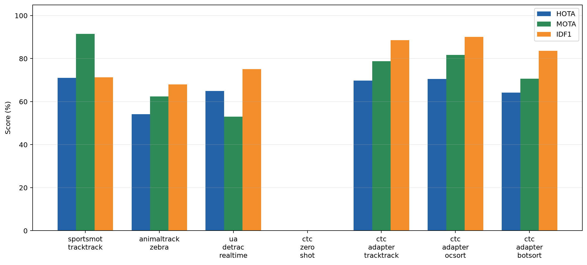
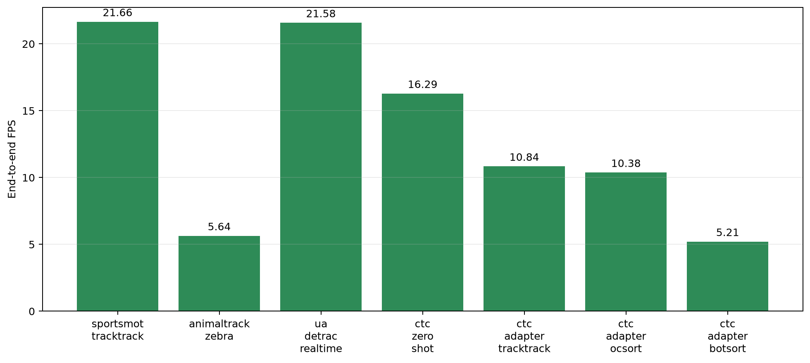
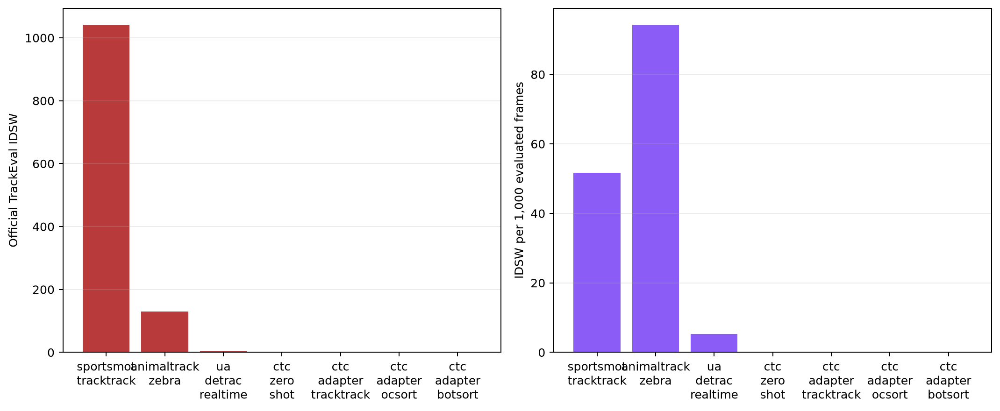

# Multi-domain tracking benchmark

Hardware: NVIDIA GeForce RTX 4060 Laptop GPU, 8.0 GiB VRAM, 14 physical CPU cores.

| Domain / setting | Detector + tracker | HOTA | DetA | AssA | MOTA | IDF1 | IDSW | IDSW/1k frames | E2E FPS |
|---|---|---:|---:|---:|---:|---:|---:|---:|---:|
| sports / full benchmark | YOLO26m fine-tuned + TrackTrack | 71.058 | 83.864 | 60.273 | 91.511 | 71.341 | 1042 | 51.658 | 21.658 |
| wildlife / zero-shot COCO detector | YOLO26s pretrained + TrackTrack | 54.097 | 51.097 | 59.223 | 62.393 | 68.038 | 130 | 94.340 | 5.641 |
| traffic / realtime adaptive zero-shot | YOLO26n pretrained, classes discovered by Qwen3-VL-4B + OC-SORT | 64.906 | 56.096 | 75.175 | 53.033 | 75.045 | 4 | 5.333 | 21.577 |
| medical microscopy / zero-shot open vocabulary | YOLOE-26s + TrackTrack | 0.000 | 0.000 | 0.000 | 0.000 | 0.000 | 0 | 0.000 | 16.287 |
| medical microscopy / balanced adapter | YOLO26s adapter, trained on sequence 01 only + TrackTrack | 69.713 | 63.322 | 76.821 | 78.745 | 88.595 | 0 | 0.000 | 10.839 |
| medical microscopy / realtime adapter | YOLO26s adapter, 640 px profile + OC-SORT | 70.559 | 64.753 | 76.981 | 81.685 | 90.054 | 0 | 0.000 | 10.376 |
| medical microscopy / accuracy adapter | YOLO26s adapter, 960 px profile + BoT-SORT ReID | 64.217 | 57.573 | 71.726 | 70.719 | 83.619 | 0 | 0.000 | 5.208 |

## Reading the table

- Dataset difficulty, class ontology, resolution, and frame rate differ; compare profiles within a dataset before comparing raw scores across domains.
- CTC rows use bounding boxes derived from TRA masks and TrackEval; they do not replace the official CTC DET/SEG/TRA evaluator.
- Zero-shot failures are retained as results, not removed from the comparison.
- FPS is tied to the hardware above and is not portable to another GPU/CPU.

- **sportsmot_tracktrack**: 20,171 frames; full 30-sequence saved benchmark, not the 300-frame smoke run.
- **animaltrack_zebra**: Official Zebra GT; Qwen discovered wildlife/zebra but also hallucinated crocodile in the sampled scene.
- **ua_detrac_realtime**: Qwen recovered a truncated JSON response, normalized taxi to car, and routed person/bicycle/car/bus to the COCO detector; GT evaluation covers UA-DETRAC vehicles.
- **ctc_zero_shot**: Qwen discovered microscopy/cell correctly; zero detections produced 4,575 false negatives.
- **ctc_adapter_tracktrack**: Domain adapter trained on sequence 01 and evaluated only on unseen sequence 02.
- **ctc_adapter_ocsort**: Realtime profile changes detector settings as well as tracker; this is not a fixed-detection tracker-only ablation.
- **ctc_adapter_botsort**: Accuracy profile changes detector settings as well as tracker; this is not a fixed-detection tracker-only ablation.

