# Single-Qwen Realtime Tracking Research Report

Hardware: NVIDIA GeForce RTX 4060 Laptop GPU (8.0 GB VRAM), 20 logical CPU threads.

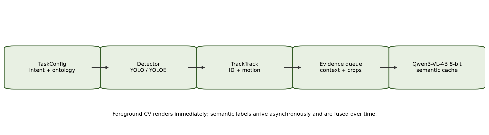

## Measurement contract

- **detector:** SportsMOT val, 2,900 images, same 640 px protocol
- **sportsmot_tracking:** 30 sequences, 20,171 frames, shared detections, TrackEval
- **multidomain_tracking:** official or normalized GT evaluated by TrackEval
- **runtime:** three repeated foreground runs per profile: detector + tracker + queue bookkeeping + MP4 render; Qwen measured separately
- **semantic:** 20 predicted tracks matched to official UA-DETRAC GT; selected-track batch inference
- **idsw_taxonomy:** heuristic diagnostic partition; official IDSW remains the TrackEval value

## SportsMOT detector evaluation

| Detector | Training | Precision | Recall | mAP50 | mAP50-95 | Detector FPS | E2E FPS |
|---|---|---:|---:|---:|---:|---:|---:|
| YOLO26m fine-tuned | SportsMOT train | 0.9595 | 0.9601 | 0.9793 | 0.8306 | 54.97 | 42.40 |
| YOLO26m pretrained | COCO pretrained | 0.8662 | 0.9026 | 0.8935 | 0.7361 | 55.16 | 41.29 |
| YOLOv8m pretrained | COCO pretrained | 0.8555 | 0.9139 | 0.8932 | 0.7229 | 6.91 | 6.62 |
| YOLO26n pretrained | COCO pretrained | 0.7865 | 0.8377 | 0.8401 | 0.5894 | 65.08 | 44.20 |

## SportsMOT tracking

| Tracker | HOTA | DetA | AssA | MOTA | IDF1 | IDSW | Cached FPS |
|---|---:|---:|---:|---:|---:|---:|---:|
| TrackTrack | 71.058 | 83.864 | 60.273 | 91.511 | 71.341 | 1042 | 43.73 |
| BoT-SORT ReID (stable) | 68.503 | 80.080 | 58.643 | 88.451 | 71.352 | 895 | 13.15 |
| DeepSORT | 60.096 | 80.131 | 45.163 | 85.896 | 57.530 | 3724 | 16.90 |
| OC-SORT | 59.379 | 72.918 | 48.413 | 87.479 | 66.108 | 2186 | 66.59 |
| FastTracker | 58.702 | 73.450 | 46.985 | 88.129 | 64.325 | 2220 | 153.37 |
| ByteTrack | 58.032 | 72.524 | 46.496 | 87.021 | 64.106 | 1828 | 148.93 |
| Deep OC-SORT ReID | 55.949 | 69.815 | 44.899 | 81.478 | 65.038 | 2016 | 14.93 |
| SORT | 41.216 | 74.128 | 22.984 | 83.428 | 36.440 | 7734 | 74.13 |

## Multidomain tracking with GT

| Task | Domain | Frames | HOTA | MOTA | IDF1 | IDSW | FPS |
|---|---|---:|---:|---:|---:|---:|---:|
| ua_detrac_tracktrack | traffic | 750 | 66.127 | 50.523 | 74.482 | 3 | 18.26 |
| ua_detrac_class_gate | traffic | 750 | 64.993 | 49.733 | 73.463 | 4 | 20.78 |
| animaltrack_yoloe | wildlife | 1378 | 37.719 | 30.567 | 43.542 | 272 | 6.74 |
| ctc_none | medical_microscopy | 92 | 67.890 | 75.248 | 86.442 | 0 | 21.26 |
| ctc_clahe | medical_microscopy | 92 | 69.526 | 80.373 | 88.009 | 0 | 17.76 |

## Traffic class-association ablation

Both rows use the same video, detector, TrackTrack thresholds, preprocessing setting, and official GT. Only the hard detector-class gate changes.

| Association | HOTA | MOTA | IDF1 | IDSW | Frag | FPS |
|---|---:|---:|---:|---:|---:|---:|
| Class-agnostic + temporal class stabilization | 66.127 | 50.523 | 74.482 | 3 | 19 | 18.26 |
| Hard detector-class gate | 64.993 | 49.733 | 73.463 | 4 | 23 | 20.78 |

The class-agnostic profile is selected for production because it raises HOTA by 1.134, raises IDF1 by 1.019, and reduces IDSW by 1 on this controlled sequence.

## Repeated foreground runtime

| Profile | Runs | Processing FPS | Source progress FPS | P95 latency | Drop rate | Peak VRAM |
|---|---:|---:|---:|---:|---:|---:|
| football_tracktrack_300 | 3 | 11.03 +/- 0.20 | 10.67 +/- 0.17 | 101.79 ms | 0.00% | 0.151 GiB |
| traffic_ua_auto_300 | 3 | 18.45 +/- 0.27 | 17.83 +/- 0.28 | 63.70 ms | 0.00% | 0.073 GiB |
| traffic_ua_none_300 | 3 | 21.01 +/- 3.30 | 20.33 +/- 3.22 | 60.87 ms | 0.00% | 0.073 GiB |
| traffic_street_auto_300 | 3 | 30.05 +/- 7.32 | 29.10 +/- 7.06 | 41.94 ms | 0.00% | 0.073 GiB |
| classroom_auto_300 | 3 | 17.86 +/- 0.81 | 17.31 +/- 0.78 | 64.99 ms | 0.00% | 0.073 GiB |
| classroom_none_300 | 3 | 19.23 +/- 1.16 | 18.63 +/- 1.13 | 62.37 ms | 0.00% | 0.073 GiB |
| wildlife_yoloe_300 | 3 | 22.32 +/- 0.22 | 21.62 +/- 0.23 | 49.19 ms | 0.00% | 0.153 GiB |
| microscopy_adapter_92 | 3 | 10.47 +/- 1.21 | 10.16 +/- 1.18 | 105.63 ms | 0.00% | 0.070 GiB |
| microscopy_none_92 | 3 | 15.22 +/- 0.11 | 14.64 +/- 0.10 | 74.71 ms | 0.00% | 0.070 GiB |

## Physical webcam foreground benchmark

| Profile | Runs | Processing FPS | Source progress FPS | P95 latency | Drop rate |
|---|---:|---:|---:|---:|---:|
| bounded_tracking_only | 3 | 53.41 | 30.02 | 33.48 ms | 0.33% |
| bounded_semantic_deferred | 3 | 53.82 | 30.01 | 33.27 ms | 0.33% |
| no_drop_semantic_deferred | 3 | 54.23 | 30.00 | 32.18 ms | 0.00% |

## Current TaskConfig webcam integration smoke

This 150-frame integration run used the current TaskConfig path. The camera driver exposed no nominal FPS and delivered about one frame per second, so these values must not be read as model capacity.

| Profile | Frames/s from camera | Processing FPS | P95 latency |
|---|---:|---:|---:|
| bounded_tracking_only | 1.00 | 18.26 | 85.06 ms |
| bounded_semantic_queue | 1.00 | 15.75 | 93.22 ms |
| no_drop_semantic_queue | 0.96 | 23.20 | 48.28 ms |

## Open-vocabulary tracking-threshold ablation

| Profile | Detections | Detection coverage | Track boxes | Track coverage | IDs | FPS |
|---|---:|---:|---:|---:|---:|---:|
| open_t010 | 188 | 52.7% | 143 | 42.0% | 2 | 18.13 |
| open_t015 | 188 | 52.7% | 41 | 13.7% | 1 | 18.58 |
| open_t020 | 188 | 52.7% | 0 | 0.0% | 0 | 19.15 |

## ID-switch diagnostic taxonomy

Counts and percentages below are heuristic diagnostics. Official TrackEval IDSW remains the ranking metric.

| Tracker | Official IDSW | Diagnostic events | Fragmentation | Identity swap | ReID failure | Association | Appearance |
|---|---:|---:|---:|---:|---:|---:|---:|
| sort | 7734 | 9312 | 2551 (27.4%) | 990 (10.6%) | 545 (5.9%) | 1819 (19.5%) | 3407 (36.6%) |
| deepsort | 3724 | 6097 | 742 (12.2%) | 954 (15.6%) | 475 (7.8%) | 1380 (22.6%) | 2546 (41.8%) |
| bytetrack | 1828 | 1971 | 636 (32.3%) | 497 (25.2%) | 570 (28.9%) | 89 (4.5%) | 179 (9.1%) |
| botsort_reid | 895 | 1070 | 186 (17.4%) | 363 (33.9%) | 486 (45.4%) | 13 (1.2%) | 22 (2.1%) |
| ocsort | 2186 | 2690 | 818 (30.4%) | 678 (25.2%) | 456 (17.0%) | 258 (9.6%) | 480 (17.8%) |
| deepocsort_reid | 2016 | 2571 | 504 (19.6%) | 1360 (52.9%) | 250 (9.7%) | 123 (4.8%) | 334 (13.0%) |
| fasttrack | 2220 | 2413 | 731 (30.3%) | 760 (31.5%) | 565 (23.4%) | 109 (4.5%) | 248 (10.3%) |
| tracktrack | 1042 | 1302 | 252 (19.4%) | 380 (29.2%) | 493 (37.9%) | 72 (5.5%) | 105 (8.1%) |

## Qwen semantic evaluation

| GT tracks | Accuracy | Known-class Macro-F1 | Coverage | Selective accuracy | Unknown F1 | Hallucination |
|---:|---:|---:|---:|---:|---:|---:|
| 20 | 75.0% | 91.7% | 75.0% | 73.3% | 61.5% | 26.7% |

The current evidence-panel smoke processed 1 event with status `ok`; it is an execution test, not an accuracy estimate.

## Main conclusions

- TrackTrack gives the strongest SportsMOT HOTA in the saved shared-detection benchmark; BoT-SORT ReID has fewer official ID switches but much lower throughput.
- On the controlled UA-DETRAC ablation, class-agnostic association followed by temporal class stabilization outperforms a hard class gate and is therefore the production multiclass policy.
- Open-vocabulary detection is not automatically more accurate: YOLOE zebra tracking is detector-limited in the current zero-shot profile.
- CLAHE improves the held-out microscopy tracking score but costs foreground FPS, so preprocessing remains task-specific.
- The physical webcam foreground path sustains the 30 FPS source rate; Qwen labels are asynchronous and have a separate semantic latency.

## Limitations

- Three runtime repeats estimate run-to-run spread, but they are not confidence intervals for every possible hardware state.
- AnimalTrack open-vocabulary quality is detector-limited and should not be generalized to all wildlife.
- The current single-Qwen panel smoke verifies execution, not classroom semantic accuracy.
- The current TaskConfig camera smoke was capture-limited to about 1 source FPS (camera reported 0 FPS), so it validates integration but is not a throughput comparison.
- Multidomain semantic labels remain draft until human review is complete.
- IDSW subtypes are heuristic; only total TrackEval IDSW is an official metric.

## Figures

### Research Detector Quality

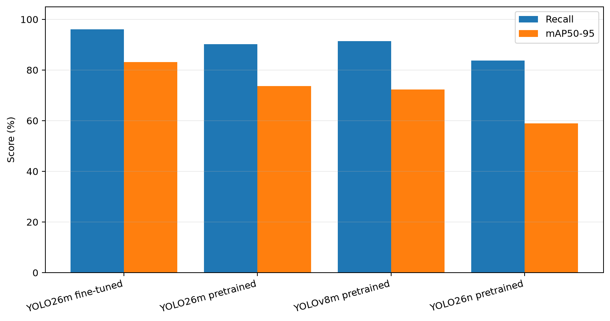

### Research Tracker Quality

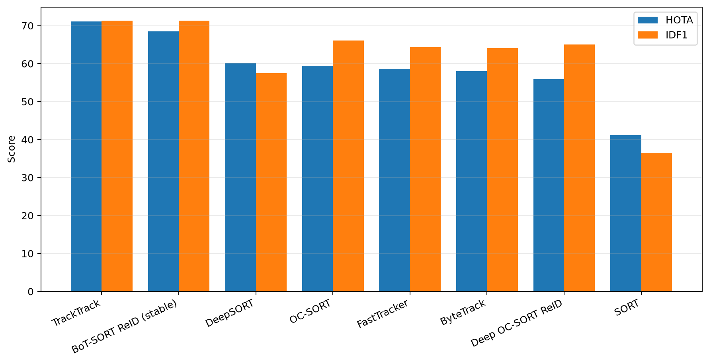

### Research Tracker Tradeoff

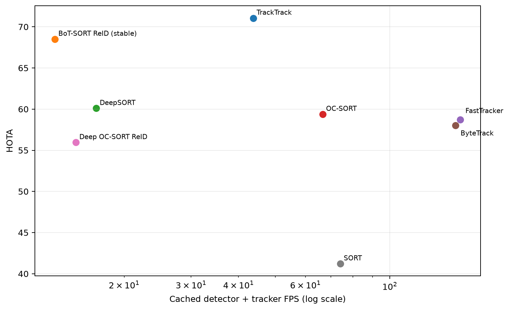

### Research Multidomain Tracking

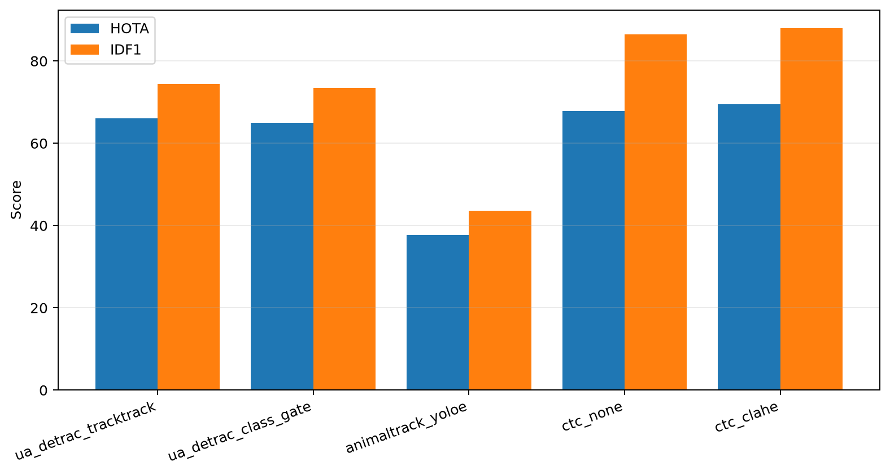

### Research Preprocessing Ablation

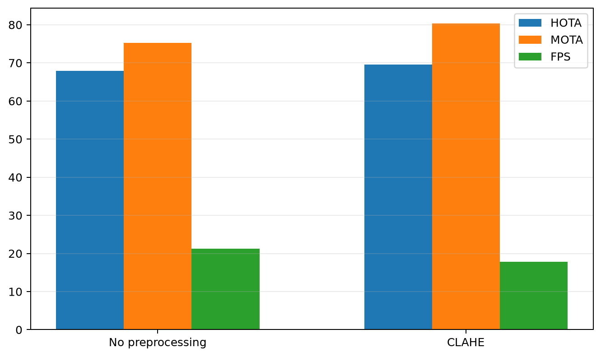

### Research Class Gate Ablation

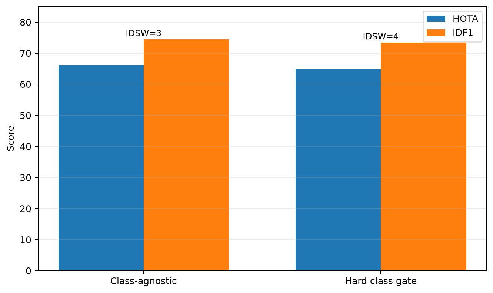

### Research Runtime Fps

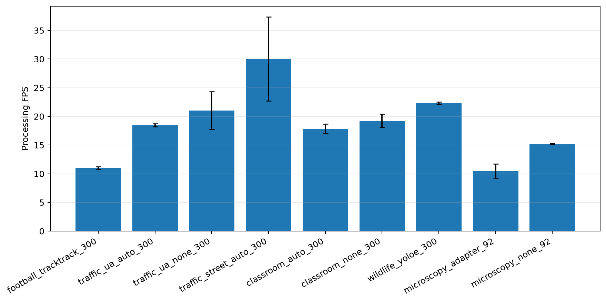

### Research Open Threshold Ablation

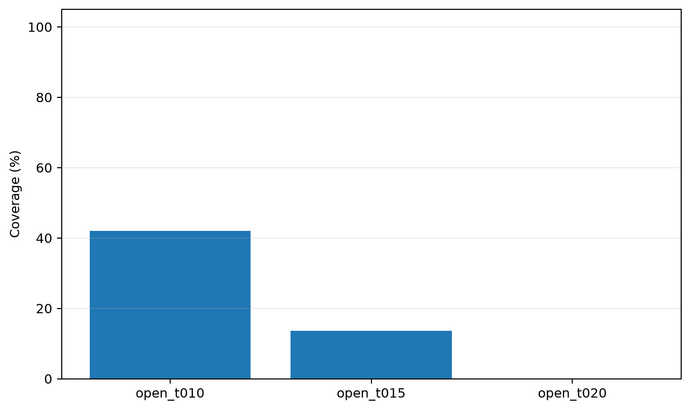

### Research Semantic Quality

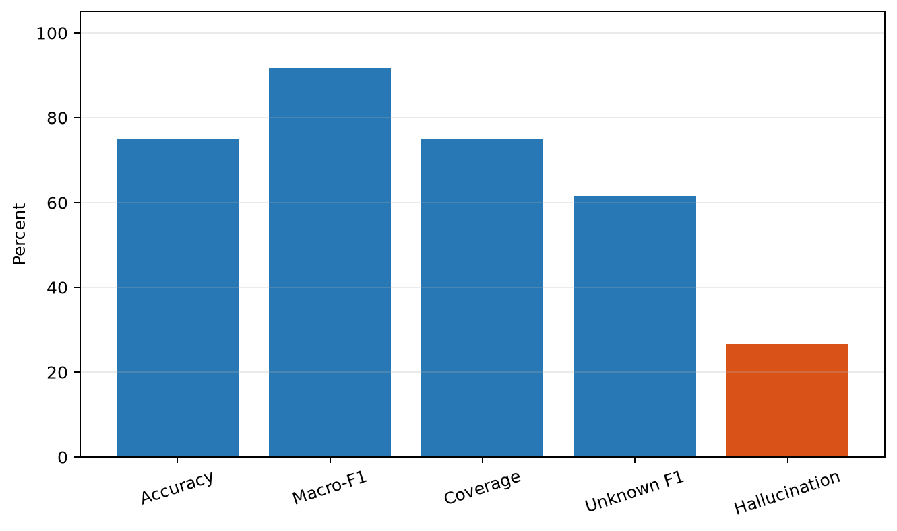

### Research Idsw Taxonomy

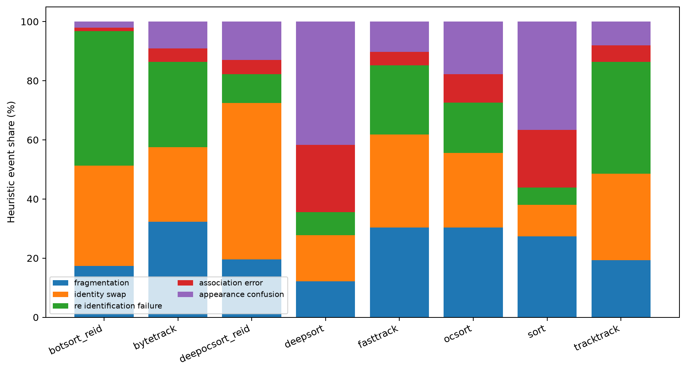

### Research Pipeline Architecture

