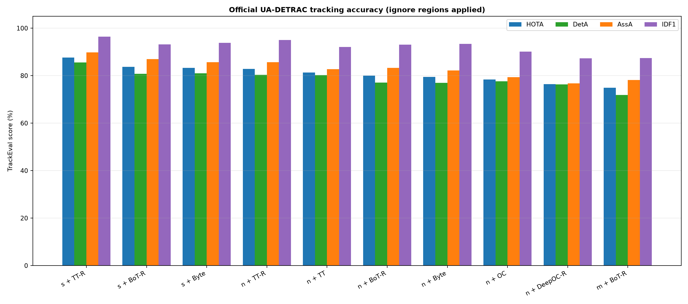
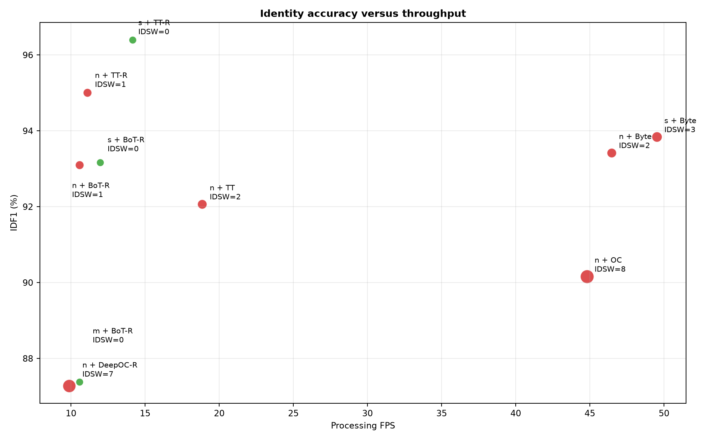
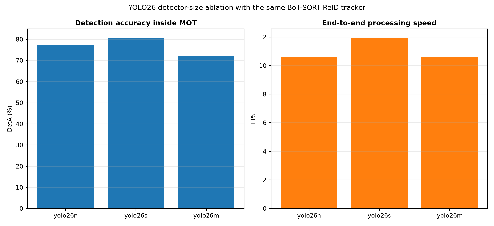
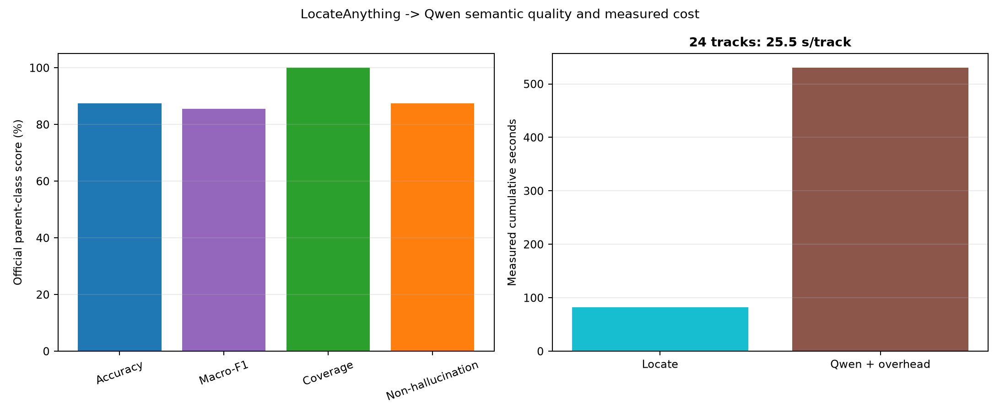

# Traffic quality benchmark

## Result summary

- Best quality: **YOLO26s + TrackTrack CNN-ReID**, HOTA 87.605, IDF1 96.399, IDSW 0, 14.16 FPS.
- Best speed: **YOLO26s + ByteTrack**, 49.52 FPS, HOTA 83.250, IDSW 3.
- Semantic parent class: 87.5% accuracy, 85.5% Macro-F1 on 8 official GT tracks.

## Tracking table

| Detector + tracker | HOTA | DetA | AssA | MOTA | IDF1 | IDSW | FP | FN | FPS |
|---|---:|---:|---:|---:|---:|---:|---:|---:|---:|
| YOLO26s + TrackTrack CNN-ReID | 87.605 | 85.611 | 89.828 | 92.752 | 96.399 | 0 | 165 | 116 | 14.16 |
| YOLO26s + BoT-SORT ReID | 83.747 | 80.793 | 86.991 | 86.923 | 93.163 | 0 | 84 | 423 | 11.96 |
| YOLO26s + ByteTrack | 83.250 | 81.001 | 85.707 | 88.187 | 93.841 | 3 | 142 | 313 | 49.52 |
| YOLO26n + TrackTrack CNN-ReID | 82.820 | 80.342 | 85.674 | 91.772 | 95.010 | 1 | 130 | 188 | 11.11 |
| YOLO26n + TrackTrack | 81.330 | 80.224 | 82.760 | 91.643 | 92.070 | 2 | 130 | 192 | 18.85 |
| YOLO26n + BoT-SORT ReID | 80.031 | 77.111 | 83.320 | 87.903 | 93.098 | 1 | 66 | 402 | 10.58 |
| YOLO26n + ByteTrack | 79.486 | 76.979 | 82.215 | 88.419 | 93.423 | 2 | 125 | 322 | 46.45 |
| YOLO26n + OC-SORT | 78.391 | 77.644 | 79.314 | 88.496 | 90.164 | 8 | 175 | 263 | 44.81 |
| YOLO26n + DeepOCSORT ReID | 76.430 | 76.297 | 76.744 | 87.542 | 87.274 | 7 | 235 | 241 | 9.88 |
| YOLO26m + BoT-SORT ReID | 74.878 | 71.837 | 78.198 | 77.018 | 87.381 | 0 | 99 | 792 | 10.58 |

## Semantic table

| Pipeline | Processed | Scored GT | Unscored | Accuracy | Macro-F1 | Coverage | Hallucination | Fine-label GT | Time/track |
|---|---:|---:|---:|---:|---:|---:|---:|---:|---:|
| LocateAnything-3B 8-bit -> Qwen3-VL-4B 8-bit | 24 | 8 | 16 | 87.5% | 85.5% | 100.0% | 12.5% | 0 | 25.51 s |

`Unscored` means the class-incomplete UA-DETRAC GT does not annotate that predicted object. It is not treated as semantic unknown or as a semantic model error.

## Metric scope

- HOTA balances detection and identity association; IDF1 measures ID consistency.
- IDSW, FP, FN and Frag come from TrackEval against official GT.
- Ignore regions from the UA-DETRAC XML are applied to GT and predictions.
- Fine-label accuracy and unknown-rejection F1 are N/A because this GT has neither vehicle subtype/color labels nor a reviewed unknown class.
- FPS is the measured processing loop with rendering and MP4 output on the hardware recorded below; semantic VLM inference runs after tracking.

## Hardware

- GPU: NVIDIA GeForce RTX 4060 Laptop GPU
- GPU memory: 8.0 GiB
- CPU: Intel64 Family 6 Model 183 Stepping 1, GenuineIntel
- RAM: 15.7 GiB
- PyTorch/CUDA: 2.11.0+cu128 / 12.8

## Figures

